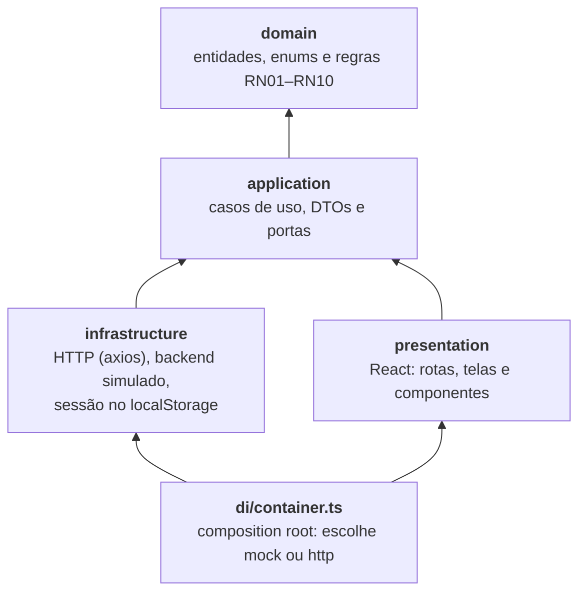

<div align="center">


# Arena Beach Tennis — Frontend

**Quadras, clientes, reservas e pagamentos de uma arena de beach tennis em uma única aplicação web.**

[Começando](#começando) · [Documentação](docs/README.md) · [Arquitetura](docs/architecture.md) · [Telas e fluxos](docs/screens.md) · [Contrato da API](docs/api-contract.md)


</div>

| Cliente — reservar quadra | Administrador — visão geral da arena |
| :-: | :-: |
|  |  |

## Sumário

- [Sobre o projeto](#sobre-o-projeto)
- [Funcionalidades](#funcionalidades)
- [Tecnologias](#tecnologias)
- [Arquitetura](#arquitetura)
- [Começando](#começando)
- [Scripts](#scripts)
- [Estrutura do projeto](#estrutura-do-projeto)
- [Rotas](#rotas)
- [Testes](#testes)
- [Integração com o backend](#integração-com-o-backend)
- [Documentação](#documentação)
- [Roadmap](#roadmap)
- [Contribuindo](#contribuindo)
- [Equipe](#equipe)
- [Licença](#licença)
- [Créditos](#créditos)

## Sobre o projeto

Aplicação web da **Ottawa Tech** para gerenciar uma arena de beach tennis. O **cliente** consulta a
disponibilidade das quadras, reserva um horário e acompanha o pagamento; o **administrador** gerencia
clientes, quadras, reservas e pagamentos. O escopo é o MVP descrito na _Especificação 1.0_ (Sprints 1 a 6).

O backend oficial é uma API REST em ASP.NET Core. Enquanto ela não expõe todos os endpoints, o frontend
roda com um **backend simulado no navegador**, que implementa o mesmo contrato e as mesmas regras de
negócio. Trocar para a API real exige apenas mudar uma variável de ambiente
([como fazer](docs/getting-started.md#usando-a-api-real)).

> A Especificação 1.0 cita Angular para o frontend; esta implementação usa **React**, mantendo as rotas,
> as telas e a separação de responsabilidades previstas na especificação.

## Funcionalidades

**Cliente**

- Criar a própria conta, entrar e atualizar os próprios dados.
- Consultar as quadras e os horários livres de qualquer dia nos próximos 30 dias.
- Reservar escolhendo data, quadra, duração (1 hora, 1h30 ou 2 horas) e horário, com o valor calculado.
- Pagar a reserva por Pix ou cartão (simulados) ou em dinheiro (o administrador confirma o recebimento).
- Acompanhar reservas e pagamentos; cancelar até 4 horas antes do início, com estorno do pagamento.

**Administrador**

- Dashboard com clientes ativos, reservas e recebimentos do dia e ocupação por quadra.
- Grade de reservas por dia, quadra e horário, com detalhe, alteração e cancelamento.
- Quadras: cadastro, edição e status (ativa, em manutenção ou inativa).
- Clientes: cadastro, edição, busca, filtros, paginação e inativação sem apagar o histórico.
- Pagamentos: filtros por status, confirmação de recebimentos e recibos.

**Em todo o sistema**

- Regras de negócio RN01–RN10 aplicadas no domínio e no backend simulado
  ([detalhes](docs/business-rules.md)).
- Controle de acesso por perfil nas rotas e nas operações.
- Validação de formulários, mensagens de sucesso e erro, estados de carregamento e de lista vazia.
- Layout responsivo (verificado a partir de 375 px) no tema escuro da Ottawa Tech.

## Tecnologias

| Tecnologia | Uso |
| --- | --- |
| [React 19](https://react.dev) + [TypeScript 5.9](https://www.typescriptlang.org) (`strict`) | Interface |
| [Vite 8](https://vite.dev) | Servidor de desenvolvimento (com proxy `/api`) e build |
| [React Router 7](https://reactrouter.com) | Rotas com carregamento sob demanda e guards por perfil |
| [TanStack Query 5](https://tanstack.com/query) | Cache e sincronização dos dados do servidor |
| [React Hook Form 7](https://react-hook-form.com) + [Zod 4](https://zod.dev) | Formulários e validação |
| [Axios](https://axios-http.com) | Cliente HTTP (somente na camada de infraestrutura) |
| CSS Modules + design tokens | Estilos; fontes Sora e Figtree hospedadas localmente |
| [Vitest 5](https://vitest.dev) + [Testing Library](https://testing-library.com) + jsdom | Testes |
| ESLint 10 + typescript-eslint + Prettier | Qualidade, padronização e regra de dependência entre camadas |

## Arquitetura

O código segue a **Arquitetura Limpa**: as regras de negócio ficam no centro, sem depender de React,
HTTP ou armazenamento. As camadas externas dependem das internas, nunca o contrário, e o
`npm run lint` falha se uma importação atravessar a fronteira errada.



A interface recebe os casos de uso prontos (`AppServices`) por injeção de dependência e nunca fala com
axios, repositórios ou `localStorage` diretamente. Detalhes, fluxos e decisões em
[docs/architecture.md](docs/architecture.md) e nos [ADRs](docs/adr/README.md).

## Começando

### Pré-requisitos

- [Node.js](https://nodejs.org) **20.19 ou superior** (inclui o npm)
- Git

### Instalação e execução

```bash
git clone https://github.com/GabrielLTM/court-manager-frontend.git
cd court-manager-frontend
npm install
npm run dev
```

Abra <http://localhost:5173>. Por padrão o app usa o backend simulado, então nenhum outro servidor é
necessário e não há nada para configurar.

### Contas de demonstração

| Perfil | E-mail | Senha |
| --- | --- | --- |
| Cliente | `isadora@email.com` | `123456` |
| Administrador | `admin@arena.com` | `admin123` |

Na tela de login, os botões de **Acessar como** preenchem as credenciais. Dentro do sistema, o seletor
**Cliente | Admin** do cabeçalho troca de conta sem sair. Também é possível criar uma conta em
**Criar conta**.

### Variáveis de ambiente

Opcionais; copie o modelo com `cp .env.example .env` para alterá-las.

| Variável | Padrão | Descrição |
| --- | --- | --- |
| `VITE_API_MODE` | `mock` | `mock`: backend simulado no navegador. `http`: API REST ASP.NET Core. |
| `VITE_API_BASE_URL` | `/api` | Base URL do cliente HTTP. Com o proxy do Vite, mantenha `/api`. |
| `VITE_BACKEND_URL` | `http://localhost:5160` | Destino do proxy de desenvolvimento para `/api/*`. |

Guia completo (API real, build, deploy e solução de problemas): [docs/getting-started.md](docs/getting-started.md).

## Scripts

| Comando | O que faz |
| --- | --- |
| `npm run dev` | Servidor de desenvolvimento em <http://localhost:5173> |
| `npm run build` | Checagem de tipos (`tsc -b`) e build de produção em `dist/` |
| `npm run preview` | Serve localmente o build de produção |
| `npm run typecheck` | Somente a checagem de tipos |
| `npm run lint` | ESLint, incluindo as regras de dependência entre camadas |
| `npm test` | Executa todos os testes uma vez (Vitest) |
| `npm run test:watch` | Testes em modo observação |
| `npm run format` | Formata `src/` com o Prettier |

## Estrutura do projeto

```text
court-manager-frontend/
├── docs/                 # documentação (índice em docs/README.md)
├── public/               # favicon e ícones
├── src/
│   ├── domain/           # entidades, enums, regras de negócio e DomainError
│   ├── application/      # casos de uso, DTOs, portas e a fachada AppServices
│   ├── infrastructure/   # adaptadores HTTP, backend simulado, sessão e relógio
│   ├── presentation/     # React: rotas, telas, componentes, providers e estilos
│   ├── di/               # composition root (container.ts)
│   ├── config/           # variáveis de ambiente e contas de demonstração
│   ├── shared/           # utilitários puros: datas, horários, moeda e máscaras
│   ├── test/             # configuração do Vitest
│   └── main.tsx          # ponto de entrada
├── .env.example          # modelo das variáveis de ambiente
├── eslint.config.js      # inclui a regra de dependência entre camadas
├── vite.config.ts        # Vite, proxy /api e configuração do Vitest
├── CONTRIBUTING.md
├── CHANGELOG.md
└── package.json
```

## Rotas

| Rota | Perfil | Tela |
| --- | --- | --- |
| `/login`, `/cadastro` | Público | Entrar e criar conta |
| `/reservar` | Cliente | Reservar quadra (home do cliente) |
| `/minhas-reservas` | Cliente | Minhas reservas: cancelar e pagar pendências |
| `/meus-dados` | Cliente | Atualizar o próprio cadastro |
| `/admin/dashboard` | Administrador | Visão geral da arena (home do administrador) |
| `/admin/reservas` | Administrador | Grade de reservas |
| `/admin/quadras` | Administrador | Quadras |
| `/admin/clientes` | Administrador | Clientes |
| `/admin/pagamentos` | Administrador | Pagamentos |

Sem sessão, as rotas protegidas redirecionam para `/login`; com o perfil errado, o usuário vai para a
home do próprio perfil. Imagens e fluxos de cada tela: [docs/screens.md](docs/screens.md).

## Testes

```bash
npm test
```

A suíte tem mais de 230 testes, que cobrem as regras de domínio, os casos de uso, o backend simulado,
os adaptadores HTTP e as telas (Testing Library). Estratégia, convenções e como escrever novos testes:
[docs/testing.md](docs/testing.md).

Antes de abrir um pull request, rode o conjunto de verificações:

```bash
npm run lint && npm run typecheck && npm test && npm run build
```

## Integração com o backend

O frontend consome a API REST descrita em [docs/api-contract.md](docs/api-contract.md) (autenticação
JWT, quadras, clientes, reservas e pagamentos). Para usá-la, suba o backend, defina
`VITE_API_MODE=http` e rode `npm run dev`; o Vite repassa `/api/*` para o backend sem CORS.

Na última verificação (25/09/2026, branch `Release`), o backend tinha apenas as entidades e os enums;
os endpoints, a autenticação e o banco de dados ainda faltavam. A seção 7 do contrato lista o que
precisa ser ajustado.

## Documentação

| Documento | Conteúdo |
| --- | --- |
| [docs/README.md](docs/README.md) | Índice da documentação |
| [docs/getting-started.md](docs/getting-started.md) | Instalação, configuração, API real, build, deploy e solução de problemas |
| [docs/screens.md](docs/screens.md) | Telas, fluxos de uso e capturas de tela |
| [docs/business-rules.md](docs/business-rules.md) | Requisitos funcionais, regras de negócio e permissões |
| [docs/architecture.md](docs/architecture.md) | Camadas, injeção de dependência, estado, rotas e erros |
| [docs/adr/](docs/adr/README.md) | Registros das decisões de arquitetura |
| [docs/design-system.md](docs/design-system.md) | Paleta, tipografia, tokens e componentes |
| [docs/testing.md](docs/testing.md) | Estratégia e convenções de testes |
| [docs/api-contract.md](docs/api-contract.md) | Contrato da API REST esperado do backend |
| [CHANGELOG.md](CHANGELOG.md) | Histórico de mudanças |

## Roadmap

- [x] MVP do frontend: telas de cliente e administrador sobre o backend simulado
- [x] Identidade visual da Ottawa Tech (tema escuro)
- [ ] Integrar com a API ASP.NET Core quando os endpoints estiverem disponíveis
- [ ] Testes de ponta a ponta e medição de cobertura
- [ ] Pipeline de integração contínua (lint, tipos, testes e build)
- [ ] Evoluções previstas na especificação: gateway de pagamento real, torneios, aulas e mensalidades

## Contribuindo

Contribuições são bem-vindas. Leia o [guia de contribuição](CONTRIBUTING.md) para conhecer o fluxo de
trabalho, o padrão de commits e as regras de arquitetura.

## Equipe

Projeto da equipe **Ottawa Tech**: Alexandre De Ávila, Gabriel Lessa, Isadora Oliveira e Jeferson Rodrigues.

## Licença

Este é um projeto acadêmico e ainda não possui um arquivo de licença. Antes de reutilizar o código,
fale com a equipe.

## Créditos

- Logotipo e identidade visual: Ottawa Tech.
- Fontes [Sora](https://fonts.google.com/specimen/Sora) e [Figtree](https://fonts.google.com/specimen/Figtree),
  sob a SIL Open Font License.
- Selos do topo: [Shields.io](https://shields.io).
