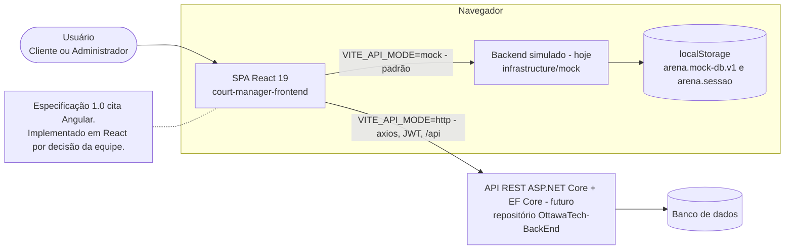
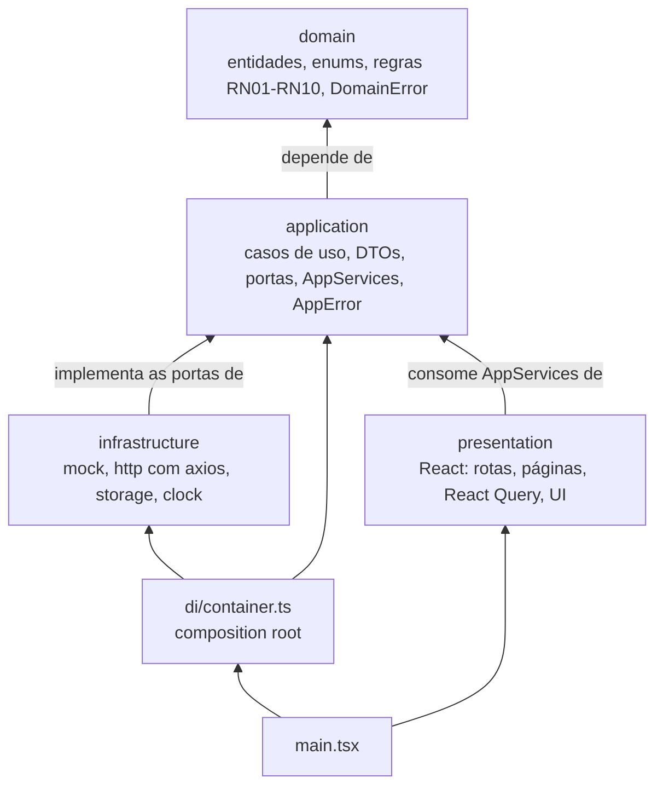
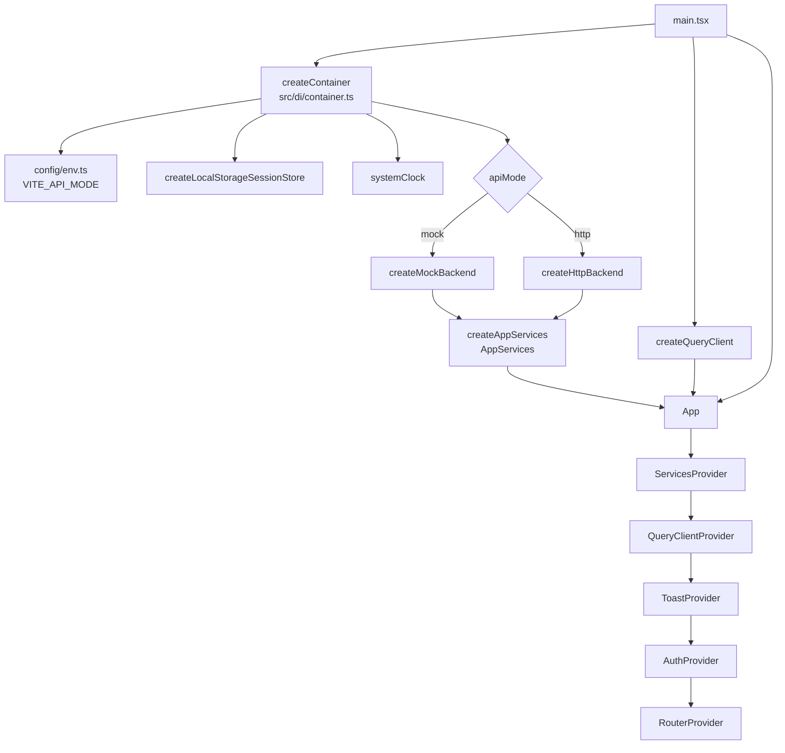
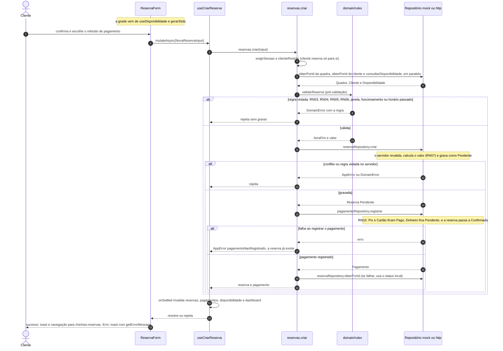
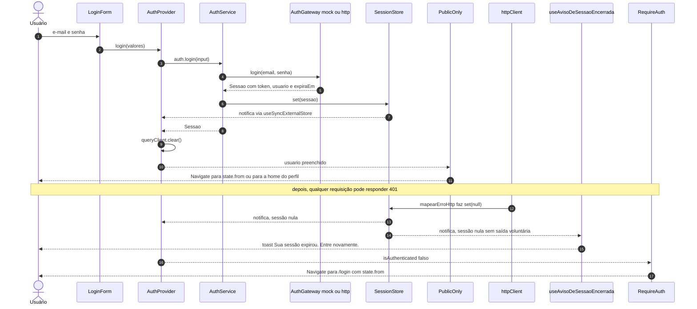
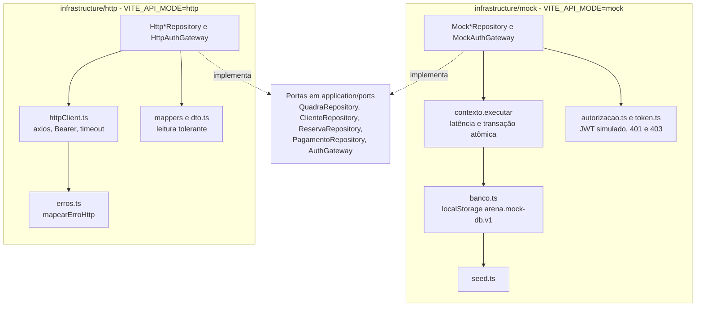

# Arquitetura

Frontend da **Arena Beach Tennis** (projeto acadêmico Ottawa Tech): SPA em React 19, TypeScript 5.9 (`strict`) e Vite 8 para gerenciar clientes, quadras, reservas e pagamentos de uma arena de beach tennis.

Documentos relacionados: [getting-started.md](getting-started.md) · [business-rules.md](business-rules.md) · [api-contract.md](api-contract.md) · [design-system.md](design-system.md) · [screens.md](screens.md) · [testing.md](testing.md) · [ADRs](adr/README.md).

## 1. Objetivo e escopo

Este documento explica **como o frontend é organizado e por quê**: camadas, composição, fluxo de dados, estado, rotas, erros, autenticação e como estender o sistema. A estrutura segue o arc42 resumido (contexto e decisões, blocos de construção, execução, conceitos transversais, qualidade e riscos); cada decisão tem um ADR em [adr/](adr/README.md).

Fora do escopo: regras de negócio em detalhe ([business-rules.md](business-rules.md)), contrato REST ([api-contract.md](api-contract.md)), tokens visuais ([design-system.md](design-system.md)), telas ([screens.md](screens.md)), testes ([testing.md](testing.md)) e instalação ([getting-started.md](getting-started.md)). A API ASP.NET Core vive em outro repositório (`OttawaTech-BackEnd`) e aparece aqui apenas como contrato.

### Contexto



- **Especificação 1.0** (documento da equipe, fora deste repositório): o frontend nunca acessa o banco de dados (seção 6.3); regras críticas são sempre validadas no backend, por exemplo, a disponibilidade é verificada de novo na criação da reserva (seção 6.3); as validações de interface melhoram a experiência e não substituem as do backend (seção 6.1); o backend se organiza em Controllers, DTOs, Services, Entities, Enums e Data (seção 11).
- **React em vez de Angular**: a especificação (seções 1 e 6) cita Angular para o frontend; esta implementação foi feita em React por decisão da equipe.
- **Backend ainda não utilizável**: em 2026-09-25 o ramo `Release` do backend tinha apenas entidades, enums e um controller de teste (sem `DbContext` funcional e sem os endpoints do contrato). Por isso o app roda, por padrão, sobre um backend simulado no navegador que segue o mesmo contrato ([ADR-0002](adr/0002-backend-simulado-no-navegador.md)). Com `VITE_API_MODE=http`, adaptadores axios falam com a API real.
- A equipe pediu boas práticas de React e padrões de Arquitetura Limpa ([ADR-0001](adr/0001-arquitetura-limpa-em-camadas.md)).

### Decisões-chave

| Decisão | Em uma frase | ADR |
| --- | --- | --- |
| Arquitetura limpa em camadas | `domain ← application ← infrastructure / presentation ← di`, com a regra de dependência verificada pelo ESLint | [0001](adr/0001-arquitetura-limpa-em-camadas.md) |
| Backend simulado no navegador | Mesmas portas, regras e autorização da API, persistidos no `localStorage`; adaptadores HTTP implementam o contrato | [0002](adr/0002-backend-simulado-no-navegador.md) |
| Estado do servidor com TanStack Query | Cache, `queryKeys`/`queryRoots` e invalidação por raiz após mutações | [0003](adr/0003-estado-do-servidor-com-tanstack-query.md) |
| Regras de negócio no domínio | RN01–RN10 como funções puras, usadas pela UI, pelos casos de uso e pelo mock | [0004](adr/0004-regras-de-negocio-no-dominio.md) |
| CSS Modules e design tokens | Tokens globais (`design-system.css`) e estilos locais por componente | [0005](adr/0005-css-modules-e-design-tokens.md) |
| Formulários com React Hook Form e Zod | Esquemas Zod, máscaras e erros do servidor exibidos junto ao campo | [0006](adr/0006-formularios-com-react-hook-form-e-zod.md) |
| Identidade visual Ottawa Tech | Tema escuro (ciano e violeta, Sora e Figtree) aplicado nos tokens, na marca e nos textos | [0007](adr/0007-identidade-visual-ottawa-tech.md) |
| Contrato de dados | Enums numéricos como objetos `as const`, datas `YYYY-MM-DD`, horários `HH:mm` | [0008](adr/0008-contrato-de-dados-enums-numericos-e-datas-iso.md) |

## 2. Visão em camadas



A seta significa "depende de". `src/shared` (funções puras) e `src/config` (variáveis de ambiente e contas de demonstração) ficam fora do diagrama e podem ser usados por qualquer camada.

| Camada | Responsabilidade | Exemplos reais |
| --- | --- | --- |
| `domain` | Entidades, enums, regras puras RN01–RN10 e `DomainError`. TypeScript puro: sem React, axios nem I/O. | [`reserva.rules.ts`](../src/domain/rules/reserva.rules.ts) (`validarReserva`, `gerarSlots`, `podeCancelarReserva`), [`DomainError.ts`](../src/domain/errors/DomainError.ts), [`enums/index.ts`](../src/domain/enums/index.ts) |
| `application` | Casos de uso, DTOs, **portas** (interfaces), fachada `AppServices`, `AppError` e mensagens compartilhadas. | [`services.ts`](../src/application/services.ts), [`createAppServices.ts`](../src/application/createAppServices.ts), [`ports/`](../src/application/ports/), [`use-cases/reservas.ts`](../src/application/use-cases/reservas.ts) |
| `infrastructure` | Implementa as portas: backend simulado, adaptadores HTTP (axios), `SessionStore` no `localStorage` e relógio do sistema. | [`createMockBackend.ts`](../src/infrastructure/mock/createMockBackend.ts), [`createHttpBackend.ts`](../src/infrastructure/http/createHttpBackend.ts), [`LocalStorageSessionStore.ts`](../src/infrastructure/storage/LocalStorageSessionStore.ts), [`SystemClock.ts`](../src/infrastructure/clock/SystemClock.ts) |
| `presentation` | React: rotas e guards, features por tela, componentes de UI, providers, hooks do React Query e esquemas Zod. | [`router.tsx`](../src/presentation/app/router.tsx), [`ReservaForm.tsx`](../src/presentation/features/reservar/components/ReservaForm.tsx), [`queries/reservas.ts`](../src/presentation/queries/reservas.ts) |
| `di` | **Composition root**: escolhe o backend e monta os casos de uso. | [`container.ts`](../src/di/container.ts) |

Contratos entre as camadas:

- **Portas** (`application/ports`): `QuadraRepository`, `ClienteRepository`, `ReservaRepository`, `PagamentoRepository` (métodos no formato REST), `AuthGateway`, `SessionStore` e `Clock`. Toda falha rejeita com `AppError` ou `DomainError`.
- **`AppServices`**: fachada consumida pela interface, com `auth`, `perfil`, `quadras`, `clientes`, `reservas`, `pagamentos`, `dashboard` e `clock`. Os métodos são closures (não dependem de `this`) e podem ser desestruturados.
- **`createAppServices(deps)`** monta a fachada a partir de `AppDependencies` (as portas); não conhece mock nem HTTP.
- **Casos de uso** coordenam: restringem o perfil Cliente aos próprios dados (`clienteRestrito`), pré-validam com as regras do domínio (`preValidarReserva`), compõem modelos de leitura (`ReservaDetalhada`, `PagamentoDetalhado`, `ResumoDashboard`) e encadeiam operações (reservar e pagar).
- **Erros**: `DomainError` (regra de negócio) × `AppError` (aplicação e infraestrutura); ver [seção 7](#7-tratamento-de-erros).

### Regra de dependência (imposta por [`eslint.config.js`](../eslint.config.js))

| Arquivos (`files`) | Imports proibidos (`no-restricted-imports`) |
| --- | --- |
| `src/domain/**` | `@/application/*`, `@/infrastructure/*`, `@/presentation/*`, `@/di/*`, `react`, `axios` |
| `src/application/**` | `@/infrastructure/*`, `@/presentation/*`, `@/di/*`, `react`, `axios` |
| `src/infrastructure/**` | `@/presentation/*`, `@/di/*`, `react` |
| `src/presentation/**` | `@/infrastructure/*`, `axios` |

- A regra casa apenas imports pelo alias `@/`; no estado atual não há imports relativos entre camadas.
- Ela **não** proíbe `presentation → di` (nem restringe `src/shared`, `src/config` e `src/di`). Por convenção, só [`main.tsx`](../src/main.tsx) importa `di/container`.
- `src/config/demo.ts` importa `domain/enums`; portanto `config` não é totalmente livre de dependências de camada.

`src/shared/lib` reúne funções puras de data (`date.ts`), horário (`time.ts`), moeda e formatação (`format.ts`) e máscaras (`masks.ts`). `src/config` tem [`env.ts`](../src/config/env.ts) (lê `VITE_*`) e [`demo.ts`](../src/config/demo.ts) (`CONTAS_DEMO`).

## 3. Composição e injeção de dependência



- [`main.tsx`](../src/main.tsx) chama `createContainer()` e `createQueryClient()` uma vez e renderiza `<App services queryClient />` dentro de `StrictMode`.
- [`createContainer`](../src/di/container.ts) usa `systemClock`, cria o `SessionStore` e escolhe o backend: `createMockBackend({ sessionStore, clock })` ou `createHttpBackend({ baseURL, sessionStore })`. Os dois devolvem o mesmo tipo `AdaptadoresBackend` ([`backend.ts`](../src/infrastructure/backend.ts)), então a troca é verificada pelo compilador. O resultado entra em `createAppServices({ ...backend, sessionStore, clock })`.
- **Mock × http** é decidido uma vez, na inicialização, por [`env.ts`](../src/config/env.ts): `apiMode` é `http` somente se `VITE_API_MODE === 'http'`; qualquer outro valor resulta em `mock`. `apiBaseUrl` vem de `VITE_API_BASE_URL` (padrão `/api`). Em desenvolvimento o proxy do Vite ([`vite.config.ts`](../vite.config.ts)) repassa `/api` para `VITE_BACKEND_URL` (padrão `http://localhost:5160`), sem CORS. `isMockMode` habilita elementos só de demonstração (`DemoRoleSwitch`, `AcessoRapido`). Variáveis em [`.env.example`](../.env.example).
- **`AppProviders`** compõe `ServicesProvider` → `QueryClientProvider` → `ToastProvider` → `AuthProvider`. Os componentes obtêm os casos de uso com `useServices()`.
- **A apresentação nunca importa a infraestrutura** (nem `axios`): a única fronteira é `AppServices`, mais DTOs e entidades. Detalhes HTTP (cabeçalhos, status) chegam à UI apenas como `AppError`, e os testes injetam `AppServices` falsos ([`fakeServices.ts`](../src/presentation/app/testing/fakeServices.ts)) sobre o mapa de rotas real ([`renderApp.tsx`](../src/presentation/app/testing/renderApp.tsx)).
- **`SessionStore` e `Clock` são injetados**: o primeiro é lido pelos casos de uso (`exigirSessao`), pelo interceptor do axios (token) e pela autorização do mock; o segundo, pelos casos de uso, por `useHoje()`, pelo mock (semente e "agora") e pela expiração da sessão. Os testes congelam o tempo ([`ambiente.ts`](../src/infrastructure/mock/__tests__/ambiente.ts)).

## 4. Fluxo de dados

### 4.1 Reservar quadra (RF09 + RF14)



Pontos de atenção: (a) a pré-validação usa as regras do domínio, as mesmas que o mock aplica como "servidor", mas o servidor sempre revalida (Especificação 1.0, seção 6.3); (b) reserva e pagamento são **duas chamadas** (`POST /api/reservas` e `POST /api/pagamentos`), então a falha do segundo passo deixa a reserva pendente, que pode ser paga depois em "Minhas reservas"; (c) `useCriarReserva` invalida em `onSettled`, ou seja, também após erro, para recarregar a disponibilidade; em caso de erro, a UI fecha o diálogo e limpa o horário escolhido.

### 4.2 Login e perda de sessão (401)



`useAvisoDeSessaoEncerrada` (montado em `AppLayout`) avisa quando a sessão some sem o usuário ter clicado em "Sair". O mesmo caminho cobre expiração por tempo e logout em outra aba.

## 5. Estado

| Tipo | Mecanismo | Onde |
| --- | --- | --- |
| Dados do servidor | TanStack Query | [`presentation/queries/`](../src/presentation/queries/), [`queryClient.ts`](../src/presentation/providers/queryClient.ts) |
| Sessão | `SessionStore` + `useSyncExternalStore` | [`LocalStorageSessionStore.ts`](../src/infrastructure/storage/LocalStorageSessionStore.ts), [`AuthProvider.tsx`](../src/presentation/providers/AuthProvider.tsx) |
| Notificações | Context + `useState` | [`ToastProvider.tsx`](../src/presentation/providers/ToastProvider.tsx) |
| UI local | `useState`, `useReducer`, React Hook Form | páginas e componentes de cada feature |

Não há store global (Redux, Zustand): o que não é dado do servidor é local ou passa pelos três providers.

**Dados do servidor.** Os hooks de [`queries/`](../src/presentation/queries/) envolvem `AppServices` (via `useServices()`). [`keys.ts`](../src/presentation/queries/keys.ts) define `queryRoots` (raízes como `['reservas']`) e `queryKeys` (chaves completas com filtros, como `['reservas', filtro]`); prefixos permitem invalidar uma raiz inteira. Os padrões de [`queryClient.ts`](../src/presentation/providers/queryClient.ts): `staleTime` de 30 s, sem refetch ao focar a janela, nenhuma nova tentativa para `DomainError` nem para `AppError` com `status` abaixo de 500 (até 2 novas tentativas nos demais casos, como falha de rede) e mutações sem retry. `useDisponibilidade` fica desabilitada sem quadra e usa `staleTime` de 10 s. Após cada mutação, [`useInvalidate`](../src/presentation/queries/useInvalidate.ts) invalida as raízes afetadas:

| Mutação | Raízes invalidadas |
| --- | --- |
| `useCriarReserva` (em `onSettled`), `useAlterarReserva`, `useCancelarReserva` | `reservas`, `pagamentos`, `disponibilidade`, `dashboard` |
| `useRegistrarPagamento`, `useConfirmarPagamento` | `pagamentos`, `reservas`, `dashboard` |
| `useCriarQuadra` | `quadras`, `dashboard` |
| `useAtualizarQuadra`, `useAlterarStatusQuadra` | `quadras`, `disponibilidade`, `dashboard` |
| `useCriarCliente`, `useAlterarStatusCliente` | `clientes`, `dashboard` |
| `useAtualizarCliente` | `clientes`, `reservas`, `pagamentos`, `dashboard` |
| `useAtualizarPerfil` | `perfil`, `reservas` |

O `AuthProvider` chama `queryClient.clear()` em `login`, `registrar` e `logout`: as chaves não incluem o usuário, então o cache é descartado a cada troca de conta.

**Sessão.** `SessionStore` é a porta; `createLocalStorageSessionStore` a implementa na chave `arena.sessao`. `AuthProvider` assina o store com `useSyncExternalStore` e deriva `usuario`, `isAuthenticated` e `isAdmin`. `get()` devolve a mesma referência enquanto a sessão não muda (exigência do `useSyncExternalStore`). Sessões inválidas ou expiradas (`expiraEm`) são descartadas na leitura, e um timer faz o logout no instante da expiração. Eventos `storage` sincronizam login e logout entre abas. Sem `localStorage` disponível, a sessão fica só em memória.

**Toasts.** `ToastProvider` mantém uma notificação por vez, por 2,6 s (4 s nos erros), via `useToast()` (`show`, `success`, `error`), em uma região `role="status"` com `aria-live="polite"`.

**Estado local.** `ReservaForm` usa `useReducer(selecaoReducer, ...)` para os passos data, quadra, duração e horário: trocar um dos três primeiros invalida o horário escolhido. O reducer é puro e fica em [`reservar.utils.ts`](../src/presentation/features/reservar/reservar.utils.ts). Filtros, paginação ([`usePagination`](../src/presentation/hooks/usePagination.ts)) e diálogos abertos são `useState` das páginas; formulários usam React Hook Form ([ADR-0006](adr/0006-formularios-com-react-hook-form-e-zod.md)).

## 6. Roteamento e acesso

O app usa o roteador de dados do React Router 7 (`createBrowserRouter`, necessário para `handle`, `errorElement` e `ScrollRestoration`). [`router.tsx`](../src/presentation/app/router.tsx) exporta `appRoutes`, reutilizado nos testes com `createMemoryRouter`. Caminhos em [`paths.ts`](../src/presentation/routes/paths.ts) (`ROUTES`, `homePathFor`).

```text
RootLayout  (errorElement: RouteErrorPage, Suspense, ScrollRestoration, título da aba)
├── /                HomeRedirect
├── PublicOnly       /login, /cadastro
├── RequireAuth
│   └── AppLayout    (cabeçalho, navegação por perfil, Suspense)
│       ├── RequireRole(Cliente)         errorElement: RouteErrorPage embedded
│       │     /reservar, /minhas-reservas, /meus-dados
│       └── /admin  RequireRole(Administrador)   errorElement: RouteErrorPage embedded
│             índice, /admin/dashboard, /admin/reservas, /admin/quadras, /admin/clientes, /admin/pagamentos
└── *                NotFoundPage
```

| Rota | Acesso | Página (carregada sob demanda) | Título da aba |
| --- | --- | --- | --- |
| `/` | qualquer | `HomeRedirect`: home do perfil ou `/login` | — |
| `/login`, `/cadastro` | público (`PublicOnly`) | `LoginPage` (`modo` entrar ou criar) | Entrar, Criar conta |
| `/reservar` | Cliente | `ReservarPage` (home do cliente) | Reservar quadra |
| `/minhas-reservas` | Cliente | `MinhasReservasPage` | Minhas reservas |
| `/meus-dados` | Cliente | `MeusDadosPage` | Meus dados |
| `/admin` | Administrador | redireciona para `/admin/dashboard` | — |
| `/admin/dashboard` | Administrador | `DashboardPage` (home do administrador) | Dashboard |
| `/admin/reservas` | Administrador | `GradeReservasPage` | Grade de reservas |
| `/admin/quadras` | Administrador | `QuadrasPage` | Quadras |
| `/admin/clientes` | Administrador | `ClientesPage` | Clientes |
| `/admin/pagamentos` | Administrador | `PagamentosPage` | Pagamentos |
| `*` | qualquer | `NotFoundPage` | Página não encontrada |

As rotas planejadas na Sprint 5 da especificação (`/login`, `/cadastro`, `/minhas-reservas`, `/reservar`, `/admin/clientes|quadras|reservas|pagamentos`) estão todas presentes; `/meus-dados` (RF02) e `/admin/dashboard` são adicionais.

- **Lazy loading**: [`lazyPages.ts`](../src/presentation/app/lazyPages.ts) declara cada página com `lazy(() => import(...))`, um chunk por rota. `RootLayout` mostra `FullPageLoading` para páginas públicas e 404; `AppLayout` tem o próprio `Suspense`, então o cabeçalho permanece enquanto a página carrega. `RouteErrorPage` não é lazy, para funcionar mesmo se o download de um chunk falhar.
- **Guards** ([`guards/`](../src/presentation/app/guards/)): `RequireAuth` leva a `/login` sem sessão, guardando a origem em `state.from` (`pathname`, `search`, `hash`). `RequireRole` envia o usuário de outro perfil para a própria home. `PublicOnly` redireciona quem já tem sessão (inclusive logo após o login) para `destinoAposLogin`, que volta à origem **somente** se `perfilExigido(pathname)` for o perfil que entrou, senão vai à home; só rotas protegidas conhecidas são aceitas, então não há redirecionamento para endereços externos. A troca de aba em `LoginPage` preserva `state`.
- **Reatividade**: como `RequireAuth` lê `useAuth()`, qualquer perda de sessão (Sair, expiração, 401, outra aba) leva ao login sem código extra nas páginas.
- **Erros de rota**: falhas de renderização aparecem dentro do layout (`RouteErrorPage embedded`) nas áreas por perfil, ou em tela cheia no restante ([`errorInfo.ts`](../src/presentation/features/errors/errorInfo.ts) distingue 404, falha ao carregar chunk e erro genérico; detalhes técnicos só em desenvolvimento). Erros de **dados** não chegam aos boundaries: `AsyncContent` mostra `ErrorState` com "Tentar novamente".
- **Títulos**: cada rota declara `handle.title`; `useDocumentTitle()` (em `RootLayout`) monta `"<título> · Arena Beach Tennis"` a partir da correspondência mais específica ([`routeHandle.ts`](../src/presentation/app/routeHandle.ts)).

## 7. Tratamento de erros

| | `DomainError` | `AppError` |
| --- | --- | --- |
| Origem | `domain` (regras e validações) | `application` e `infrastructure` (HTTP, autenticação, não encontrado) |
| Campos | `regra`: `RN01`…`RN10` ou `VALIDACAO` | `code` (`NAO_AUTENTICADO`, `ACESSO_NEGADO`, `NAO_ENCONTRADO`, `CONFLITO`, `VALIDACAO`, `REDE`, `DESCONHECIDO`), `status?`, `fieldErrors?`, `cause` |
| Guarda de tipo | `isDomainError` | `isAppError` |

`mapearErroHttp` ([`erros.ts`](../src/infrastructure/http/erros.ts)) converte toda falha do axios em `AppError`, no interceptor de resposta de [`httpClient.ts`](../src/infrastructure/http/httpClient.ts):

| Situação | `code` | Mensagem | `fieldErrors` |
| --- | --- | --- | --- |
| Sem resposta | `REDE` | tempo esgotado ou sem conexão com a API | não |
| 400, 422 | `VALIDACAO` | corpo da resposta ou "Dados inválidos…" | sim |
| 401 no login | `NAO_AUTENTICADO` | "E-mail ou senha inválidos." | não |
| 401 nas demais rotas | `NAO_AUTENTICADO` | "Sua sessão expirou. Entre novamente." e a sessão local é limpa | não |
| 403 | `ACESSO_NEGADO` | corpo, ou "Cadastro inativo…" no login, ou "Você não tem permissão…" | não |
| 404 | `NAO_ENCONTRADO` | corpo ou "Registro não encontrado." | não |
| 409 | `CONFLITO` | corpo ou "A operação conflita com dados já existentes." | sim |
| 5xx | `DESCONHECIDO` | "Erro inesperado no servidor. Tente novamente mais tarde." | não |
| Outros status | `DESCONHECIDO` | corpo ou "Não foi possível concluir a operação." | não |

Corpos aceitos: `ProblemDetails` e `ValidationProblemDetails` (`title`, `detail`, `errors`), `{ message }` ou texto simples. Títulos padrão em inglês ("Bad Request"…), páginas HTML e textos longos são descartados; as chaves de `errors` são normalizadas (`$.valorHora` → `valorHora`, `Nome` → `nome`, vazio → `geral`). O mock lança os mesmos `AppError` ([`mock/erros.ts`](../src/infrastructure/mock/erros.ts)) e compartilha os textos por [`mensagens.ts`](../src/application/mensagens.ts).

Na interface:

- **`getErrorMessage(error, fallback)`** ([`errors.ts`](../src/presentation/lib/errors.ts)): primeiro erro de campo de um `AppError`, senão `error.message`, senão o texto padrão.
- **`aplicarErrosDoServidor(error, setError, campos)`** ([`serverErrors.ts`](../src/presentation/lib/serverErrors.ts)): copia `fieldErrors` para os campos do formulário (nomes comparados sem caixa nem símbolos) e mapeia `RN01` para `cpf` e `RN02` para `email`; foca o primeiro campo e devolve se algo foi aplicado. Usada em cadastro, "Meus dados" e cliente do administrador.
- **Padrões de feedback**: sucesso com `toast.success`; falha de mutação com `toast.error(getErrorMessage(erro))`, normalmente somado ao erro no campo; avisos neutros (horário ocupado, quadra indisponível) com `toast.show`; falha de consulta com `ErrorState` e refetch; erro de renderização com `RouteErrorPage`.

## 8. Autenticação e autorização

1. **Login e cadastro** (`POST /api/auth/login`, `POST /api/auth/register`) devolvem `Sessao { token, usuario, expiraEm }`. `mapearSessao` usa o objeto `usuario` ou, se ele faltar, as claims do JWT (`sub`, `name`, `email`, `role`, `clienteId`, além dos `ClaimTypes` longos do .NET). O frontend só **decodifica** o payload ([`jwt.ts`](../src/infrastructure/shared/jwt.ts)); não valida assinatura.
2. **Onde o token fica**: na `Sessao` persistida em `localStorage` (`arena.sessao`), gerida pelo `SessionStore`. Qualquer script da mesma origem consegue lê-lo.
3. **Envio**: o interceptor de requisição do axios lê `sessionStore.get()?.token` e define `Authorization: Bearer <token>`. O mock não usa HTTP: [`autorizacao.ts`](../src/infrastructure/mock/autorizacao.ts) lê o mesmo token da sessão a cada operação.
4. **401 limpa a sessão**: `mapearErroHttp` faz `sessionStore.set(null)` (exceto no login); o mock responde 401 sem sessão e, com token adulterado ou expirado, também limpa a sessão. A UI reage como na [seção 4.2](#42-login-e-perda-de-sessão-401).
5. **Guards e `clienteRestrito` são conveniência de UX**, não segurança: escondem o que o perfil não deve ver e evitam consultas fadadas ao 403.

Regras de autorização do backend simulado, equivalentes a `[Authorize]` (401 sem token válido) e a `[Authorize(Roles = "Administrador")]` (403 para o Cliente):

| Recurso | Cliente | Administrador |
| --- | --- | --- |
| Quadras: listar, obter, disponibilidade | permitido | permitido |
| Quadras: criar, atualizar, inativar | 403 | permitido |
| Clientes: listar, criar, inativar | 403 | permitido |
| Clientes: obter, atualizar | só o próprio, sem alterar o `status` | qualquer |
| Reservas: listar | só com o próprio `clienteId` | todas |
| Reservas: obter, alterar, cancelar | só as próprias | todas |
| Reservas: criar | só para si | para qualquer cliente |
| Pagamentos: listar | só com o próprio `clienteId` | todos |
| Pagamentos: obter, registrar | só das próprias reservas | todos |
| Pagamentos: confirmar | 403 | permitido |

> **A API real precisa autenticar e autorizar cada requisição** ([api-contract.md](api-contract.md), seções 2, 3, 5 e 7). Tudo que o frontend e o mock fazem é pré-validação e especificação de comportamento; quem protege os dados é o backend.

## 9. Backend simulado × adaptadores HTTP



| Pasta | Conteúdo |
| --- | --- |
| `mock/` | `createMockBackend.ts` monta os adaptadores (opções `sessionStore`, `clock`, `latencyMs`, `storage`); `Mock*Repository.ts` e `MockAuthGateway.ts` implementam as portas, sempre via `contexto.executar`; `agendamento.ts` (revalida a reserva com `validarReserva` e calcula o valor, RN07), `cadastro.ts` (RN01/RN02), `consultas.ts`, `erros.ts`, `tipos.ts` (tabelas) e `latencia.ts`. |
| `http/` | `httpClient.ts` (axios, `baseURL`, timeout de 15 s, interceptors), `erros.ts`, `Http*Repository.ts` e `HttpAuthGateway.ts` (uma rota REST por método; respostas vazias, como `204`, em `PUT`, cancelar e confirmar são relidas com `GET`), `dto.ts` (formatos canônicos) e `mappers/` (`entidades`, `enums`, `leitura`, `requisicoes`, `sessao`). |
| `shared/`, `storage/`, `clock/` | `filtros.ts` (usado pelo mock como consulta e reaplicado pelos repositórios HTTP, caso a API ignore parâmetros), `jwt.ts`, `registro.ts`; `armazenamento.ts` e `LocalStorageSessionStore.ts`; `SystemClock.ts`. |

- **Latência**: aleatória entre 150 e 400 ms por operação (`latencyMs` ajusta; os testes usam 0).
- **Persistência**: o "banco" é um JSON `{ versao, dados }` em `localStorage`, na chave `arena.mock-db.v1` (tabelas `administradores`, `clientes`, `quadras`, `reservas`, `pagamentos`); a sessão fica em `arena.sessao`. Cada operação roda sobre uma **cópia** e só grava se concluir (atomicidade), relê o armazenamento (abas enxergam os mesmos dados) e devolve cópias profundas. Se o storage falhar, segue em memória. A cada operação, reservas `Confirmada` cujo horário terminou passam a `Concluída`.
- **Semente**: [`seed.ts`](../src/infrastructure/mock/seed.ts) é criada no primeiro acesso, com datas **relativas a hoje** (`dia: 0` é hoje, `1` amanhã, `-6` seis dias atrás), de modo que o app sempre abre com agenda atual. As contas de demonstração estão em `config/demo.ts` (ver [getting-started.md](getting-started.md)).
- **Restaurar os dados**: apague as chaves `arena.mock-db.v1` e `arena.sessao` (DevTools, Application, Local Storage) ou limpe os dados do site. Existe também `resetMockDatabase()` ([`mock/index.ts`](../src/infrastructure/mock/index.ts)), que recria a semente sem alterar a sessão; hoje só os testes o usam e nenhuma tela o chama (a apresentação não importa a infraestrutura).
- **Contrato**: o mock é a implementação de referência do [api-contract.md](api-contract.md); os adaptadores HTTP são leitores tolerantes (chaves sem diferenciar caixa, enums por número ou nome, `TimeOnly` `19:00:00`), detalhados no [ADR-0008](adr/0008-contrato-de-dados-enums-numericos-e-datas-iso.md).

## 10. Camada de apresentação

| Pasta (`src/presentation/`) | Conteúdo |
| --- | --- |
| `app/` | `App`, `router.tsx`, `lazyPages.ts`, `RootLayout`, `guards/`, `layout/` (`AppLayout`, `MainNav`, `navigation.ts`, `DemoRoleSwitch`) e `testing/` (`fakeServices`, `renderApp`). |
| `features/<tela>/` | `auth`, `reservar`, `minhas-reservas`, `perfil`, `admin/{dashboard,grade,quadras,clientes,pagamentos,shared}` e `errors`. Em geral: `*Page.tsx` (`export default`, carregado sob demanda), `components/`, `*.utils.ts`, `*.module.css` e `__tests__/`. |
| `components/` | `ui/` (primitivos do design system exportados por [`index.ts`](../src/presentation/components/ui/index.ts): `Button`, `Card`, `Dialog`, `Field`, `Input`, `Pill`, `DataTable`, `AsyncContent`, estados de carregamento, vazio e erro, `BrandMark`…), `DateSelector`, `SlotGrid`, `MetodoPagamentoPicker` e `forms/ClienteFields`. |
| `providers/`, `queries/`, `hooks/`, `lib/`, `validation/`, `routes/`, `styles/` | Contextos e providers; hooks do React Query; `useHoje` e `usePagination`; `errors` e `serverErrors`; esquemas Zod; `ROUTES`; tokens e fontes. |

Convenções:

- **Páginas finas**: uma página obtém dados por um hook de `queries/`, delega a renderização a `AsyncContent` e a componentes da própria feature e não conhece HTTP nem `localStorage`.
- **Lógica de visão pura em `*.utils.ts`** (sem React nem I/O), testada isoladamente: `reservar.utils.ts` (`selecaoReducer`, `linhasResumo`, `montarNovaReserva`), `grade.utils.ts` (`montarGrade`), `minhasReservas.utils.ts` (`calcularEstatisticas`, `ordenarReservas`), `dashboard.utils.ts` (`montarIndicadores`), `clientes.utils.ts`, `pagamentos.utils.ts`, `quadras.utils.ts`.
- **Regras vêm do domínio**: a interface usa `gerarSlots`, `janelaDeReserva` e `calcularValorReserva` em vez de reimplementá-las.
- **Provider em dois arquivos**: contexto e hook de acesso em `*Context.ts`; componente provedor em `*Provider.tsx`.
- **Estilo**: CSS Modules ao lado do componente, consumindo os tokens ([ADR-0005](adr/0005-css-modules-e-design-tokens.md), [design-system.md](design-system.md)).
- **Acessibilidade presente no código** (sem auditoria formal): link "Pular para o conteúdo" e `main` focável, `nav` com `aria-label`, `Dialog` modal (`role="dialog"`, `aria-modal`, Esc fecha, foco inicial e devolução do foco), `aria-pressed` nas pílulas, `role="alert"` em erros de campo e `ErrorState`.

## 11. Qualidade

- **TypeScript** ([`tsconfig.app.json`](../tsconfig.app.json)): `strict`, `noUnusedLocals`, `noUnusedParameters`, `erasableSyntaxOnly` (sem `enum` do TS, ver [ADR-0008](adr/0008-contrato-de-dados-enums-numericos-e-datas-iso.md)), `noFallthroughCasesInSwitch`, `noUncheckedSideEffectImports`, `verbatimModuleSyntax`, `moduleResolution: bundler` e alias `@/*` para `src/*` (repetido em `vite.config.ts`). [`tsconfig.node.json`](../tsconfig.node.json) aplica as mesmas flags a `vite.config.ts`.
- **ESLint** (flat config): `@eslint/js`, `typescript-eslint`, `react-hooks`, `react-refresh` e as regras de camadas da [seção 2](#regra-de-dependência-imposta-por-eslintconfigjs). `npm run lint` falha em violação de fronteira.
- **Prettier** ([`.prettierrc.json`](../.prettierrc.json)): `npm run format`. Não há checagem automática: `prettier --check` aponta divergências em parte dos arquivos.
- **Testes**: Vitest + Testing Library em jsdom (`globals`, `setupFiles` em [`setup.ts`](../src/test/setup.ts), que limpa o DOM e o `localStorage`). Camadas testadas: regras do domínio, casos de uso com dublês, backend simulado com latência 0 e relógio fixo, adaptadores HTTP (cliente e mapeadores), rotas e guards, páginas. Estratégia em [testing.md](testing.md).
- **Build**: `npm run build` executa `tsc -b && vite build`. Cada `lazy()` de [`lazyPages.ts`](../src/presentation/app/lazyPages.ts) gera um chunk por página; o código compartilhado vai para chunks comuns.
- **Verificação local**: `npm run lint`, `npm run typecheck`, `npm test` e `npm run build`.

## 12. Guia: como adicionar uma funcionalidade

Siga a ordem das camadas, de dentro para fora:

1. **Domínio**: regra pura em `domain/rules/*.rules.ts` (novo `CodigoRegra` em `DomainError.ts`, se preciso); entidades e enums em `entities/` e `enums/` (valores numéricos iguais aos do backend, mais `*_LABEL` e `*_VALUES`). Teste em `domain/rules/__tests__/`.
2. **DTO e porta**: tipos em `application/dto/index.ts`; método na porta (`ports/repositories.ts`) e na interface do serviço (`services.ts`).
3. **Caso de uso**: `application/use-cases/*.ts`, ligado em `createAppServices.ts`. Use `exigirSessao` e `clienteRestrito`, pré-valide com o domínio e reuse `mensagens.ts`. Teste com dublês, como em `use-cases/__tests__/reservas.test.ts`.
4. **Adaptadores**:
   - *mock*: implemente em `Mock*Repository.ts` (via `executar` e `autorizacao`), ajuste a semente e, se o formato das tabelas mudar, `CHAVE_BANCO_MOCK` e `VERSAO` em `banco.ts`;
   - *http*: rota em `Http*Repository.ts`, formato em `dto.ts`, mapeadores em `mappers/` (e leitor de enum em `mappers/enums.ts`, se houver enum novo). Atualize o [api-contract.md](api-contract.md).
5. **Query hook**: em `presentation/queries/*.ts`, com chave em `keys.ts` e invalidação das raízes corretas na mutação.
6. **Página, rota e guard**: `features/<tela>/XPage.tsx` (`export default`) e `lazyPages.ts`; caminho em `routes/paths.ts`; rota com `handle.title` em `router.tsx`; item em `layout/navigation.ts`. Em rotas de **cliente**, inclua o caminho em `ROTAS_DO_CLIENTE` de `guards/access.ts`, ou `destinoAposLogin` ignorará a origem. Formulários: esquema em `validation/schemas.ts` e `aplicarErrosDoServidor`; lógica de visão em `*.utils.ts`; enums novos também em `ui/status.ts`, para as tags.
7. **Testes**: unitários (domínio e `*.utils.ts`), caso de uso, mock e página (com `createFakeServices` e `renderAppAt`). Ver [testing.md](testing.md).
8. **Documentação**: [api-contract.md](api-contract.md) (contrato), [business-rules.md](business-rules.md) (regras), [screens.md](screens.md) (telas) e um [ADR](adr/README.md) se a decisão for arquitetural.

## 13. Limitações conhecidas e evolução

- **Dados do mock ficam no `localStorage`**: são por navegador e perfil, sem multiusuário nem concorrência reais, limitados pela cota do storage (se falhar, segue em memória). O segredo do JWT simulado está no código do cliente, então o token só detecta edição manual: não é segurança.
- **O mock não é um oráculo independente**: reutiliza `domain/rules` e validações da aplicação (`validarDadosCliente`, `verificarCancelamentoPermitido`). Um erro de regra apareceria na pré-validação e no "servidor" ao mesmo tempo. Além disso, o modo `mock` não exercita `infrastructure/http`: há testes do cliente axios e dos mapeadores, mas os `Http*Repository` não têm testes de requisição (o `container.test.ts` só confere que o modo `http` monta os adaptadores) e não existe teste de integração com uma API real.
- **Modo `http` depende do backend**: o contrato está em [api-contract.md](api-contract.md) (seção 7 lista ajustes pendentes no ramo `Release`). Os mapeadores toleram variações, mas não substituem um backend aderente.
- **Sem atualização em tempo real**: não há polling nem push; com `staleTime` de 30 s e sem refetch ao focar a janela, mudanças feitas por outras pessoas só aparecem após invalidação ou nova consulta.
- **Reserva e pagamento são duas chamadas** (não atômicas), e `reservas.listar` e `pagamentos.listar` compõem os modelos de leitura no cliente com várias consultas em paralelo; a paginação das tabelas é local (o contrato não pagina).
- **Cache não segmentado por usuário**: é limpo por `AuthProvider` em login, cadastro e logout; em logout forçado (401 ou expiração) o cache só é descartado no login seguinte.
- **Pequenos desvios das convenções**: `Clock` não é usado em `validation/schemas.ts` nem em `ClienteFields.tsx` (`new Date()` direto); a regra de lint não cobre imports relativos nem `presentation → di`.
- **Implantação**: `createBrowserRouter` exige que o servidor estático devolva `index.html` para rotas desconhecidas; o repositório não contém configuração de deploy nem de CI. O modo `mock` (com contas de demonstração no código) não deve ser usado em produção.
- **Sem auditoria de acessibilidade** automatizada, e só o tema escuro existe ([ADR-0007](adr/0007-identidade-visual-ottawa-tech.md)).

Caminhos de evolução (não implementados): validar o contrato contra o backend real e simplificar os mapeadores; criar reserva e pagamento em uma única operação no servidor; paginação e filtros no servidor quando o volume exigir; atualização periódica ou por push dos horários; revisar onde guardar o token se a API passar a emitir cookies.
