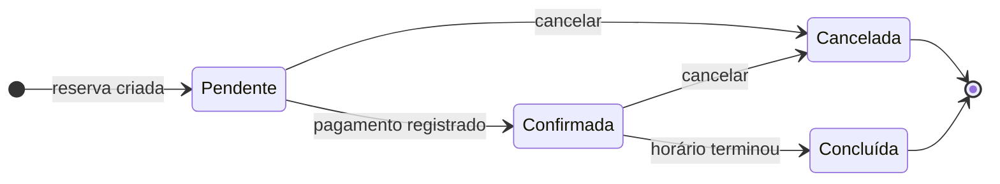
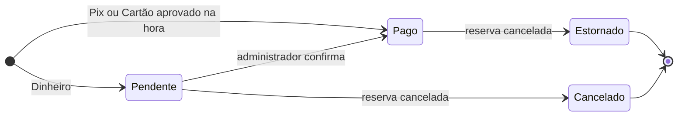

# Requisitos e regras de negócio

Este documento consolida os requisitos funcionais (RF01–RF16) e as regras de negócio (RN01–RN10) e mostra, para cada um, **onde vivem no frontend** e **quais testes os cobrem**. A fonte é a **Especificação 1.0** da equipe Ottawa Tech (*Sistema de Gestão de Arena de Beach Tennis*), citada como "Especificação 1.0, seção N"; ela não está versionada neste repositório. Onde a especificação é omissa, o código segue o protótipo *Arena Beach Tennis* (design da equipe, também fora do repositório) ou uma decisão de implementação — tudo o que vai além da especificação está listado, com a origem, na seção 9.

Documentos relacionados: [architecture.md](architecture.md) (camadas e injeção de dependência), [api-contract.md](api-contract.md) (contrato REST e o que o servidor deve revalidar), [screens.md](screens.md) (telas e fluxos), [testing.md](testing.md) (estratégia de testes), [getting-started.md](getting-started.md) (executar e contas de demonstração), [design-system.md](design-system.md) (aparência de tags e componentes) e as decisões registradas em [adr/](adr/).

## 1. Introdução e glossário

### Como ler as tabelas

- **Domínio**: funções puras em `src/domain`. **Caso de uso**: pré-validação em `src/application/use-cases`. **Mock**: backend simulado em `src/infrastructure/mock`, que se comporta como o servidor (autentica, autoriza e revalida tudo). **UI**: telas em `src/presentation`.
- Status de um RF: **Implementado**; **Implementado (opcional)** quando a especificação o declara opcional (RF13). Lacunas em relação ao texto da especificação aparecem em negrito nas observações e na seção 9.2.
- Os testes citados foram localizados por busca no código; a lista completa por pasta está em [testing.md](testing.md).
- A especificação menciona Angular; o frontend é React por decisão da equipe. As regras independem do framework.

### Glossário

| Termo | Definição | Código |
| --- | --- | --- |
| Cliente | Pessoa que usa a arena: entidade cadastrada (nome, CPF, e-mail, telefone, nascimento, status) e, ao autenticar, perfil `Cliente`. A senha nunca faz parte do modelo de leitura. | [`Cliente`](../src/domain/entities/index.ts), [`Perfil`](../src/domain/enums/index.ts) |
| Quadra | Espaço reservável, com identificação, tipo (texto livre; o formulário sugere Beach Tennis, Futevôlei e Vôlei de praia), valor por hora e status (Ativa, Inativa, Manutenção). | `Quadra` |
| Reserva | Ocupação de uma quadra por um cliente em uma data, no intervalo `[horaInicio, horaFim)`. O código exibido é `RSV-<id>`. | `Reserva`, `formatCodigoReserva` |
| Pagamento | Registro simulado (sem gateway) do pagamento de uma reserva: valor, método, status e data. | `Pagamento` |
| Slot / horário | Horário de início oferecido na tela de reserva para uma duração escolhida; informa se está livre e, se não, o motivo. | `Slot`, `gerarSlots` |
| Disponibilidade | Resposta de `GET /api/quadras/{id}/disponibilidade?data=`: abertura, fechamento e intervalos ocupados por reservas não canceladas, sem identificar quem reservou. | `Disponibilidade` |
| Janela de reserva | Datas reserváveis: de hoje até hoje + 29 dias. | `janelaDeReserva` |

## 2. Perfis e permissões

A especificação define dois perfis (Especificação 1.0, seção 3): **Cliente** (3.1) e **Administrador** (3.2). Este documento acrescenta o **visitante** (sem sessão). O perfil vem do claim `role` do JWT; o cliente também carrega `clienteId`. A sessão fica em `localStorage` (`arena.sessao`) e expira com o token (8 h no mock). O controle tem três camadas e só a última é segurança de fato: (1) guards de rota e navegação por perfil (conveniência de interface); (2) casos de uso que restringem consultas ao cliente logado ([sessao.ts](../src/application/use-cases/sessao.ts)); (3) o servidor, que autentica e autoriza cada chamada ([autorizacao.ts](../src/infrastructure/mock/autorizacao.ts) no mock; `[Authorize]` no ASP.NET).

### 2.1 Rotas e telas

Guards: [RequireAuth](../src/presentation/app/guards/RequireAuth.tsx), [RequireRole](../src/presentation/app/guards/RequireRole.tsx), [PublicOnly](../src/presentation/app/guards/PublicOnly.tsx) e [access.ts](../src/presentation/app/guards/access.ts); mapa de rotas em [router.tsx](../src/presentation/app/router.tsx) e [paths.ts](../src/presentation/routes/paths.ts); itens de menu por perfil em [navigation.ts](../src/presentation/app/layout/navigation.ts).

| Rota | Tela | Sem sessão | Cliente | Administrador |
| --- | --- | --- | --- | --- |
| `/` | Redirecionamento | `/login` | `/reservar` | `/admin/dashboard` |
| `/login`, `/cadastro` | Entrar, Criar conta | Acessa | Vai para a página de origem (se for do perfil) ou para a home | Idem |
| `/reservar`, `/minhas-reservas`, `/meus-dados` | Reservar quadra, Minhas reservas, Meus dados | Vai para `/login` e guarda a origem | Acessa | Vai para `/admin/dashboard` |
| `/admin` (→ `/admin/dashboard`), `/admin/reservas`, `/admin/quadras`, `/admin/clientes`, `/admin/pagamentos` | Dashboard, Grade de reservas, Quadras, Clientes, Pagamentos | Vai para `/login` e guarda a origem | Vai para `/reservar` | Acessa |
| Qualquer outra | Página não encontrada (404) | Acessa | Acessa | Acessa |

### 2.2 Operações

| Operação (caso de uso) | Sem sessão | Cliente | Administrador | Imposto em |
| --- | --- | --- | --- | --- |
| Entrar e criar conta (`auth.login`, `auth.registrar`) | Sim | Sim | Sim (login) | `MockAuthGateway`; cadastro inativo recebe 403 |
| Consultar quadras e disponibilidade | 401 | Sim | Sim | `autorizacao.autenticar()` |
| Criar, editar e mudar status de quadra | 401 | 403 | Sim | `autorizacao.exigirAdministrador()` |
| Listar e buscar clientes; criar; inativar | 401 | 403 | Sim | `exigirAdministrador()` |
| Consultar e editar cadastro de cliente (`clientes.obter/atualizar`) | 401 | Só o próprio, sem mudar o `status` (403) | Qualquer um | `exigirAcessoAoCliente` |
| "Meus dados" (`perfil.obter/atualizar`) | 401 | Sim | 403 ("área exclusiva para clientes") | `exigirClienteLogado` |
| Criar reserva | 401 | Só para si: o caso de uso força o `clienteId` da sessão e o mock responde 403 para outro id | Caso de uso e API aceitam qualquer cliente; não há tela | `clienteRestrito`, `exigirAcessoAoCliente` |
| Listar e consultar reservas | 401 | Só as próprias (o caso de uso injeta `clienteId`; o mock responde 403 sem ele) | Todas, com filtros | `restringirAoCliente` |
| Alterar reserva (RF13) | 401 | Só as próprias e até 4 h antes (a UI não oferece) | Qualquer reserva não cancelada que ainda não terminou | `verificarAlteracaoPermitida` |
| Cancelar reserva | 401 | Só as próprias e até 4 h antes | Qualquer reserva não cancelada que ainda não terminou | `podeCancelarReserva` |
| Registrar pagamento | 401 | Só de reservas próprias | Qualquer reserva (sem tela) | `exigirAcessoAoCliente` |
| Listar e consultar pagamentos | 401 | Só os próprios | Todos | `restringirAoCliente` |
| Confirmar pagamento | 401 | 403 | Sim | `exigirAdministrador()` |
| Dashboard (`dashboard.obterResumo`) | 401 | 403 | Sim | Depende de listagens exclusivas do administrador |

Esconder rotas e botões é conveniência (Especificação 1.0, seção 6.1: "controlar visualmente funcionalidades conforme o perfil"). O backend real deve aplicar `[Authorize]`, `[Authorize(Roles = "Administrador")]` e as restrições por cliente ([api-contract.md](api-contract.md), seção 3).

## 3. Requisitos funcionais (RF01–RF16)

Especificação 1.0, seção 7. Atalhos: [reservas.ts](../src/application/use-cases/reservas.ts), [clientes.ts](../src/application/use-cases/clientes.ts), [pagamentos.ts](../src/application/use-cases/pagamentos.ts), [quadras.ts](../src/application/use-cases/quadras.ts); telas em [features/](../src/presentation/features/).

| ID | Requisito (resumo) | Status | Onde vive | Observações |
| --- | --- | --- | --- | --- |
| RF01 | Cadastrar cliente (nome, CPF, telefone, e-mail, nascimento, senha, status) | Implementado | Autocadastro em `/cadastro` ([CadastroForm](../src/presentation/features/auth/CadastroForm.tsx)); administrador em `/admin/clientes` ([ClienteFormDialog](../src/presentation/features/admin/clientes/components/ClienteFormDialog.tsx)); `auth.registrar`, `clientes.criar`; [validarDadosCliente](../src/application/use-cases/validarDadosCliente.ts); RN01, RN02 | O autocadastro cria o cliente Ativo e já autentica; o administrador escolhe o status |
| RF02 | Cliente ou administrador altera os dados | Implementado | `/meus-dados` ([MeusDadosPage](../src/presentation/features/perfil/MeusDadosPage.tsx)) e edição em `/admin/clientes`; `perfil.atualizar`, `clientes.atualizar` | Senha em branco mantém a atual; o cliente não altera o próprio status; nome e e-mail da sessão são sincronizados |
| RF03 | Administrador consulta clientes | Implementado | `/admin/clientes` ([ClientesPage](../src/presentation/features/admin/clientes/ClientesPage.tsx)); `clientes.listar` | Busca por nome, CPF ou e-mail (sem acento), filtro por status e paginação de 8 itens |
| RF04 | Inativar cliente sem excluir o histórico | Implementado | Botão Inativar/Reativar ([ClientesTabela](../src/presentation/features/admin/clientes/components/ClientesTabela.tsx)); `clientes.alterarStatus` (inativar usa `DELETE` lógico; reativar usa `PUT`) | Reativar é extensão do protótipo e revalida RN01; reservas existentes permanecem |
| RF05 | Cadastrar quadra (nome, tipo, valor/hora, status) | Implementado | `/admin/quadras` ([QuadraFormDialog](../src/presentation/features/admin/quadras/components/QuadraFormDialog.tsx)); `quadras.criar`; [validarDadosQuadra](../src/domain/rules/quadra.rules.ts) | Valor por hora deve ser maior que zero |
| RF06 | Alterar quadra | Implementado | Mesma tela; `quadras.atualizar` | — |
| RF07 | Inativar quadra temporariamente | Implementado | Pílulas Ativar, Manutenção e Inativar ([QuadraCard](../src/presentation/features/admin/quadras/components/QuadraCard.tsx)); `quadras.alterarStatus` | Manutenção e Inativa bloqueiam novas reservas (RN03); reservas existentes não são canceladas |
| RF08 | Consultar quadras | Implementado | Administrador: `/admin/quadras`; cliente: passo "2. Quadra" de `/reservar` ([QuadraOpcoes](../src/presentation/features/reservar/components/QuadraOpcoes.tsx)); `quadras.listar` | A API devolve todas; a UI do cliente mostra as indisponíveis desabilitadas, com o motivo |
| RF09 | Criar reserva (quadra, data, início, duração) | Implementado | `/reservar` ([ReservaForm](../src/presentation/features/reservar/components/ReservaForm.tsx)); `reservas.criar`; `validarReserva`, `gerarSlots` | Quatro passos, resumo e confirmação com pagamento; o cliente só reserva para si |
| RF10 | Verificar disponibilidade; sem reservas conflitantes | Implementado | `quadras.consultarDisponibilidade`; [reserva.rules.ts](../src/domain/rules/reserva.rules.ts); servidor: [agendamento.ts](../src/infrastructure/mock/agendamento.ts) | Ver seção 5; revalidado no servidor |
| RF11 | Cliente vê as suas reservas; administrador vê todas | Implementado | Cliente: `/minhas-reservas`; administrador: grade por data em `/admin/reservas` e "Reservas recentes" no dashboard; `reservas.listar` | A grade cobre de 30 dias atrás até o fim da janela de reservas |
| RF12 | Cancelar reserva respeitando regra de antecedência | Implementado | [CancelarReservaDialog](../src/presentation/features/minhas-reservas/components/CancelarReservaDialog.tsx) (cliente), [ReservaDetalheDialog](../src/presentation/features/admin/grade/components/ReservaDetalheDialog.tsx) (administrador); `reservas.cancelar`; `podeCancelarReserva` | RN08; efeito no pagamento na seção 6 |
| RF13 | Alterar data ou horário (opcional) | Implementado (opcional) | `/admin/reservas` → detalhe → Alterar ([AlterarReservaDialog](../src/presentation/features/admin/grade/components/AlterarReservaDialog.tsx)); `reservas.alterar` | **Só o administrador tem tela**; caso de uso e API aceitam o cliente dono. Segue a janela de RN08 e recalcula o valor |
| RF14 | Registrar pagamento (valor, data, método, status, reserva) | Implementado (simulado) | Em `/reservar` ([ConfirmarReservaDialog](../src/presentation/features/reservar/components/ConfirmarReservaDialog.tsx)) e "Pagar" em `/minhas-reservas` ([PagarReservaDialog](../src/presentation/features/minhas-reservas/components/PagarReservaDialog.tsx)); `pagamentos.registrar`; [pagamento.rules.ts](../src/domain/rules/pagamento.rules.ts) | Pix e Cartão aprovados na hora; Dinheiro fica Pendente; o valor vem da reserva |
| RF15 | Cliente consulta o status dos pagamentos | Implementado | Coluna "Pagamento" e cartão "Pagamentos pendentes" em `/minhas-reservas`; `pagamentos.listar` | Reserva sem pagamento aparece como "Pendente" |
| RF16 | Administrador registra ou confirma pagamento | Implementado | `/admin/pagamentos` ([PagamentosTabela](../src/presentation/features/admin/pagamentos/components/PagamentosTabela.tsx)): Confirmar e Recibo; `pagamentos.confirmar`; `pagamentoPodeSerConfirmado` | Só pagamentos Pendentes; "registrar" pelo administrador existe no caso de uso e na API, sem tela |

Fora da numeração RF, a especificação (seção 12) prevê autenticação JWT (Sprint 5) e dashboard, paginação e filtros (Sprint 6): `auth.*` ([auth.ts](../src/application/use-cases/auth.ts)), `/admin/dashboard` ([dashboard.ts](../src/application/use-cases/dashboard.ts)), `usePagination` e os filtros das tabelas.

## 4. Regras de negócio (RN01–RN10)

Especificação 1.0, seção 8. Atalhos de teste: [reserva.rules.test.ts](../src/domain/rules/__tests__/reserva.rules.test.ts), [cliente.rules.test.ts](../src/domain/rules/__tests__/cliente.rules.test.ts) e, em `src/infrastructure/mock/__tests__/`, [mock/reservas.test.ts](../src/infrastructure/mock/__tests__/reservas.test.ts), [mock/auth.test.ts](../src/infrastructure/mock/__tests__/auth.test.ts), [mock/administracao.test.ts](../src/infrastructure/mock/__tests__/administracao.test.ts).

| ID | Regra | Onde é aplicada | Testes |
| --- | --- | --- | --- |
| RN01 | Não pode haver mais de um cliente **ativo** com o mesmo CPF (vale também na reativação) | **Domínio:** `cpfEmUso` ([cliente.rules.ts](../src/domain/rules/cliente.rules.ts)). **Mock:** `garantirCadastroUnico` ([cadastro.ts](../src/infrastructure/mock/cadastro.ts)) no cadastro, na edição e na reativação (409 `CONFLITO`, erro no campo `cpf`). **Caso de uso:** sem pré-validação (cabe ao servidor). **UI:** erro junto ao campo CPF | [cliente.rules.test.ts](../src/domain/rules/__tests__/cliente.rules.test.ts); [mock/auth.test.ts](../src/infrastructure/mock/__tests__/auth.test.ts) (CPF de inativo é reutilizável); [mock/administracao.test.ts](../src/infrastructure/mock/__tests__/administracao.test.ts) (reativação); [MeusDadosPage.test.tsx](../src/presentation/features/perfil/__tests__/MeusDadosPage.test.tsx); [ClientesPage.test.tsx](../src/presentation/features/admin/clientes/__tests__/ClientesPage.test.tsx) |
| RN02 | O e-mail é único (sem diferenciar maiúsculas; inclui clientes inativos e contas administrativas) | **Domínio:** `emailEmUso`, `normalizarEmail`. **Mock:** `garantirCadastroUnico` (409, campo `email`). **UI:** erro junto ao campo e-mail | [cliente.rules.test.ts](../src/domain/rules/__tests__/cliente.rules.test.ts); [mock/auth.test.ts](../src/infrastructure/mock/__tests__/auth.test.ts); [LoginPage.test.tsx](../src/presentation/features/auth/__tests__/LoginPage.test.tsx) |
| RN03 | Só quadras **Ativa** recebem novas reservas (Manutenção e Inativa são bloqueadas) | **Domínio:** `quadraPodeSerReservada` ([quadra.rules.ts](../src/domain/rules/quadra.rules.ts)), `validarReserva` (RN03), `gerarSlots`. **Caso de uso:** `preValidarReserva` ([validacaoReserva.ts](../src/application/use-cases/validacaoReserva.ts)). **Mock:** `validarAgendamento`. **UI:** `QuadraOpcoes` desabilita a quadra e avisa; a tela escolhe a primeira quadra ativa | [reserva.rules.test.ts](../src/domain/rules/__tests__/reserva.rules.test.ts); [mock/reservas.test.ts](../src/infrastructure/mock/__tests__/reservas.test.ts); [reservar.utils.test.ts](../src/presentation/features/reservar/__tests__/reservar.utils.test.ts); [ReservarPage.test.tsx](../src/presentation/features/reservar/__tests__/ReservarPage.test.tsx); [grade.utils.test.ts](../src/presentation/features/admin/grade/__tests__/grade.utils.test.ts) |
| RN04 | Uma quadra não tem reservas com períodos sobrepostos (intervalos semiabertos; seção 5.2) | **Domínio:** `intervalosSobrepoem`, `haConflitoDeHorario`, `validarReserva`, `gerarSlots` (`ocupado`). **Caso de uso:** `preValidarReserva` usa a disponibilidade e, na alteração, ignora o próprio intervalo. **Mock:** `validarAgendamento` contra todas as reservas. **UI:** horários ocupados desabilitados; o erro do servidor limpa o horário escolhido | [reserva.rules.test.ts](../src/domain/rules/__tests__/reserva.rules.test.ts); [use-cases/reservas.test.ts](../src/application/use-cases/__tests__/reservas.test.ts); [mock/reservas.test.ts](../src/infrastructure/mock/__tests__/reservas.test.ts); [ReservarPage.test.tsx](../src/presentation/features/reservar/__tests__/ReservarPage.test.tsx); [grade/reserva.utils.test.ts](../src/presentation/features/admin/grade/__tests__/reserva.utils.test.ts) |
| RN05 | Toda reserva tem um cliente existente e **ativo** | **Domínio:** `validarReserva` (cliente ausente ou inativo → RN05). **Caso de uso:** `reservas.criar` força o `clienteId` da sessão. **Mock:** só o próprio cliente ou o administrador criam. **Dados:** `Reserva.clienteId` é obrigatório (inclusive no mapper HTTP) | [reserva.rules.test.ts](../src/domain/rules/__tests__/reserva.rules.test.ts) (cliente inativo); [mock/reservas.test.ts](../src/infrastructure/mock/__tests__/reservas.test.ts) ("só reserva para si mesmo"); o ramo "cliente inexistente" não tem teste dedicado |
| RN06 | Toda reserva tem uma quadra existente | **Domínio:** `validarReserva` (RN06). **Caso de uso:** `preValidarReserva` consulta a quadra (404 se não existe). **Dados:** `quadraId` obrigatório | Sem teste dedicado |
| RN07 | Valor = valor/hora × duração (R$ 80 × 2 h = R$ 160); calculado pelo servidor | **Domínio:** `calcularValorReserva`. **Mock:** `criar` grava o valor; o pagamento herda o valor da reserva; `atualizar` recalcula e acompanha o pagamento Pendente (pagamento Pago com valor diferente → `DomainError` RN07). **UI:** apenas prévia (`totalDaReserva`) | [reserva.rules.test.ts](../src/domain/rules/__tests__/reserva.rules.test.ts); [mock/reservas.test.ts](../src/infrastructure/mock/__tests__/reservas.test.ts); [reservar.utils.test.ts](../src/presentation/features/reservar/__tests__/reservar.utils.test.ts) |
| RN08 | Cliente cancela (ou altera) até 4 h antes do início; administrador cancela qualquer reserva que ainda não terminou; canceladas e concluídas não podem ser canceladas | **Domínio:** `podeCancelarReserva`. **Caso de uso:** `verificarCancelamentoPermitido` e `verificarAlteracaoPermitida` (`DomainError` RN08). **Mock:** repete a verificação. **UI:** o botão Cancelar só aparece quando permitido; nota "até 4 horas antes" | [reserva.rules.test.ts](../src/domain/rules/__tests__/reserva.rules.test.ts); [mock/reservas.test.ts](../src/infrastructure/mock/__tests__/reservas.test.ts); [grade/reserva.utils.test.ts](../src/presentation/features/admin/grade/__tests__/reserva.utils.test.ts); [MinhasReservasPage.test.tsx](../src/presentation/features/minhas-reservas/__tests__/MinhasReservasPage.test.tsx) |
| RN09 | Reserva cancelada não ocupa o horário | **Domínio:** `reservaOcupaHorario` (base de `haConflitoDeHorario` e `intervalosOcupados`). **Mock:** `cancelar` marca Cancelada; a disponibilidade omite canceladas. **HTTP:** `mapearDisponibilidade` descarta canceladas. **UI:** grade e dashboard ignoram canceladas | [reserva.rules.test.ts](../src/domain/rules/__tests__/reserva.rules.test.ts); [mock/reservas.test.ts](../src/infrastructure/mock/__tests__/reservas.test.ts); [grade.utils.test.ts](../src/presentation/features/admin/grade/__tests__/grade.utils.test.ts); [mappers.test.ts](../src/infrastructure/http/__tests__/mappers.test.ts) |
| RN10 | Uma reserva tem no máximo um pagamento **ativo** (Pendente ou Pago); Cancelado e Estornado são histórico | **Mock:** `registrar` responde 409 `CONFLITO` (`pagamentoAtivoDaReserva` em [consultas.ts](../src/infrastructure/mock/consultas.ts)). **Caso de uso:** `criarDetalhador` ([detalharReservas.ts](../src/application/use-cases/detalharReservas.ts)) escolhe o pagamento ativo. **UI:** "Pagar" só para reserva sem pagamento | [mock/reservas.test.ts](../src/infrastructure/mock/__tests__/reservas.test.ts); [minhasReservas.utils.test.ts](../src/presentation/features/minhas-reservas/__tests__/minhasReservas.utils.test.ts) |

> **O backend real deve revalidar todas as regras.** As camadas Domínio, Caso de uso e UI são pré-validações para responder rápido; a garantia é do servidor (Especificação 1.0, seção 6.3: o frontend pode mostrar um horário livre às 19h, mas o backend confere de novo ao criar a reserva, para que duas pessoas não reservem o mesmo horário). O `MockReservaRepository` cumpre esse papel e [mock/reservas.test.ts](../src/infrastructure/mock/__tests__/reservas.test.ts) chama o repositório sem a pré-validação para provar a revalidação. O que o ASP.NET deve implementar está em [api-contract.md](api-contract.md), seção 5; a decisão de simular o servidor está em [ADR-0002](adr/0002-backend-simulado-no-navegador.md).

## 5. Cálculo e disponibilidade

### 5.1 Valor da reserva (RN07)

`valor = valorHora × (duração em minutos ÷ 60)`, arredondado a centavos (`calcularValorReserva`). O cliente nunca envia o valor: `CriarReservaDados` não o contém; o servidor calcula e grava em `Reserva.valor`, e o pagamento herda esse valor. A tela mostra o mesmo cálculo como prévia.

| Quadra (R$/h) | Duração | Valor | Origem do exemplo |
| --- | --- | --- | --- |
| 80 | 2 h | R$ 160,00 | Especificação 1.0, seção 8 (RN07) |
| 95 | 1h30 | R$ 142,50 | Teste de domínio |
| 90 | 1h30 | R$ 135,00 | Teste de `ReservarPage` (Quadra 03) |

### 5.2 Conflitos (RN04 e RN09)

Intervalos são **semiabertos** `[início, fim)`: `intervalosSobrepoem(a, b)` é verdadeiro quando `a.início < b.fim` e `b.início < a.fim`. Só contam reservas da mesma quadra e data cujo status não é Cancelada (`reservaOcupaHorario`); na alteração (RF13) a própria reserva é ignorada (`ignorarReservaId`).

| Reserva existente | Nova reserva | Conflito? | Motivo |
| --- | --- | --- | --- |
| 19:00–20:00 | 19:30–20:30 | Sim | Exemplo da Especificação 1.0 (RF10) |
| 19:00–20:00 | 20:00–21:00 | Não | Encosta no fim, mas não sobrepõe |
| 19:00–20:00 | 18:00–19:00 | Não | Idem, pelo início |
| 19:00–20:00 (Cancelada) | 19:00–20:00 | Não | RN09 |

### 5.3 Geração de horários (`gerarSlots`)

Para cada horário de início ofertado (`REGRAS_RESERVA.horariosInicio`) e a duração escolhida, `gerarSlots` calcula o fim e devolve livre ou o **primeiro** motivo que se aplica, nesta ordem:

| Ordem | Motivo | Condição | Mensagem (`MOTIVO_INDISPONIBILIDADE_LABEL`) |
| --- | --- | --- | --- |
| 1 | `quadra-indisponivel` | Quadra ausente ou com status diferente de Ativa (RN03) | Quadra indisponível para reservas |
| 2 | `passado` ou `fora-da-janela` | Data anterior a hoje; data depois de hoje + 29 dias | Este horário já passou; Reservas até 30 dias à frente |
| 3 | `passado` | Data e hora de início menores ou iguais a agora | Este horário já passou |
| 4 | `fora-do-horario` | Fim depois das 22:00 (ou início antes das 07:00) | A reserva ultrapassa o horário de funcionamento (até 22h) |
| 5 | `ocupado` | Sobrepõe algum intervalo de `ocupados` | Horário indisponível nesta quadra |

Exemplo (executado contra o código): agora = 20/09/2026 12:30; Quadra 01 ativa; data 20/09/2026; duração 1h30; ocupados = 19:00–20:00.

| Início | Fim | Resultado | Por quê |
| --- | --- | --- | --- |
| 07:00 a 12:00 | 08:30 a 13:30 | `passado` | Início menor ou igual a 12:30 |
| 14:00, 15:00, 16:00, 17:00 | 15:30 a 18:30 | Livre | 17:00–18:30 termina antes das 19:00 |
| 18:00 | 19:30 | `ocupado` | Sobrepõe 19:00–20:00 |
| 19:00 | 20:30 | `ocupado` | Idem |
| 20:00 | 21:30 | Livre | Começa quando a reserva termina |
| 21:00 | 22:30 | `fora-do-horario` | Passa das 22:00 |

A grade de início (de hora em hora, sem 13:00) é só da interface; a validação do servidor é a de funcionamento (seção 9.2).

### 5.4 Ordem de validação no servidor (`validarReserva`)

`validarReserva` ([reserva.rules.ts](../src/domain/rules/reserva.rules.ts)) lança `DomainError` na primeira violação e devolve `{ horaFim, valor }`. Ordem: RN05 (cliente ausente ou inativo) → RN06 (quadra ausente) → RN03 → duração em {60, 90, 120} → janela de 30 dias → funcionamento 07:00–22:00 → horário já passou → RN04. É usada por `preValidarReserva` (caso de uso) e por `validarAgendamento` (mock), que também rejeita data e hora malformadas.

## 6. Ciclos de vida

A especificação lista os status (seção 10) mas não as transições; as abaixo vêm do código ([pagamento.rules.ts](../src/domain/rules/pagamento.rules.ts), [reserva.rules.ts](../src/domain/rules/reserva.rules.ts), repositórios do mock) e do protótipo.

### 6.1 Reserva

| Transição | Gatilho | Quem | Implementação |
| --- | --- | --- | --- |
| nova → Pendente | `reservas.criar` | Cliente | `criar` em [MockReservaRepository](../src/infrastructure/mock/MockReservaRepository.ts) |
| Pendente → Confirmada | Pagamento registrado (Pix ou Cartão aprovado, ou Dinheiro pendente) ou confirmação de um pagamento pendente | Cliente ou administrador | `statusDaReservaAposPagamento` ([pagamento.rules.ts](../src/domain/rules/pagamento.rules.ts)); [MockPagamentoRepository](../src/infrastructure/mock/MockPagamentoRepository.ts) |
| Pendente ou Confirmada → Cancelada | Cancelamento | Cliente (até 4 h antes) ou administrador (até o término) | `podeCancelarReserva`; `cancelar` |
| Confirmada → Concluída | O horário terminou | Derivado, sem ação do usuário | `statusEfetivoDaReserva`; o mock grava a cada requisição (`atualizarStatusEfetivo` em [contexto.ts](../src/infrastructure/mock/contexto.ts)) e a UI aplica a mesma função ao exibir |

- "Criar reserva" são duas chamadas: reserva e depois pagamento. Se a segunda falhar, a reserva fica Pendente sem pagamento e o cliente a quita em Minhas reservas → Pagar (mensagem `pagamentoNaoRegistrado`).
- Reserva Pendente ocupa o horário (só Cancelada o libera, RN09) e não expira. Uma Pendente cujo horário passou não vira Concluída e já não pode ser cancelada.
- Alterar (RF13) não muda o status.

### 6.2 Pagamento

| Transição | Gatilho | Implementação |
| --- | --- | --- |
| nova → Pago / Pendente | Registro do pagamento; `dataPagamento` é preenchida só quando Pago | `statusInicialDoPagamento` |
| Pendente → Pago | `pagamentos.confirmar` (só administrador; só pagamentos Pendentes: o caso de uso recusa com `VALIDACAO` e o servidor, com 409) | `pagamentoPodeSerConfirmado` |
| Pago → Estornado; Pendente → Cancelado | Cancelamento da reserva | `statusDoPagamentoAoCancelarReserva` |

Não se registra pagamento de reserva cancelada (`VALIDACAO`). Alterar uma reserva com pagamento Pendente atualiza o valor do pagamento; com pagamento Pago e valor diferente, a alteração é recusada (RN07).

## 7. Validações de formulário

Especificação 1.0, seção 6.1. Esquemas Zod em [schemas.ts](../src/presentation/validation/schemas.ts); as mesmas regras são repetidas em [validarDadosCliente.ts](../src/application/use-cases/validarDadosCliente.ts), [cliente.rules.ts](../src/domain/rules/cliente.rules.ts) e [quadra.rules.ts](../src/domain/rules/quadra.rules.ts) e revalidadas pelo mock.

| Campo | Interface (Zod) | Caso de uso e domínio | Observações |
| --- | --- | --- | --- |
| Nome | Mínimo 3 caracteres após `trim` | Idem | — |
| CPF | Obrigatório; `cpfValido` (11 dígitos, dois dígitos verificadores, rejeita sequências repetidas) | Idem | Com ou sem máscara; salvo como `000.000.000-00`; unicidade (RN01) só no servidor |
| E-mail | Obrigatório; `emailValido` (`x@y.zz`, sem espaços, 2+ caracteres após o último ponto) | Idem | Salvo em minúsculas; unicidade (RN02) só no servidor |
| Telefone | Obrigatório; 10 ou 11 dígitos (DDD + número) | `telefoneValido` | Máscara `(51) 99812-4477` |
| Data de nascimento | Obrigatória; data ISO válida, não futura e a partir de 1900 | Opcional (aceita `null`); se informada, mesmas condições | A interface é mais rígida que o caso de uso |
| Senha | Mínimo 6 caracteres no cadastro e na criação; na edição, vazio mantém a atual | `TAMANHO_MINIMO_SENHA = 6` | Sem regra de complexidade; o login exige só e-mail válido e senha preenchida. O mock guarda a senha em texto puro (demonstração); o backend real deve guardar hash |
| Status do cadastro | `1` ou `2` | `validarStatusCliente` (mock) | Só o administrador altera |
| Quadra: nome e tipo | Mínimo 2 caracteres | Não vazios (`validarDadosQuadra`) | Tipo é texto livre |
| Quadra: valor/hora | Obrigatório; `parseDecimal` maior que 0 (aceita `80`, `80,5`, `1.000,50`) | Finito e maior que 0; o mock arredonda a 2 casas | — |
| Quadra: status | `1`, `2` ou `3` | Validado contra `STATUS_QUADRA_VALUES` | — |
| Reserva | Data na janela, duração entre as três opções, só horários livres | `validarReserva`; método de pagamento entre os três válidos | — |

A validação de interface melhora a experiência e **nunca substitui** a do backend. Nos formulários de cadastro, perfil e cliente, os erros do servidor aparecem junto ao campo (`aplicarErrosDoServidor`) e em um aviso; nos de login e de quadra, só no aviso.

## 8. Enums

Especificação 1.0, seção 10. Definidos como objetos `as const` mais tipos união em [enums/index.ts](../src/domain/enums/index.ts), com rótulos em `*_LABEL` e listas em `*_VALUES`. Na API trafegam como número; a leitura HTTP é tolerante (nome com ou sem acento, número como texto, booleano legado) em [mappers/enums.ts](../src/infrastructure/http/mappers/enums.ts).

| Enum | Valores (idênticos ao C#) | Rótulos na UI |
| --- | --- | --- |
| `StatusCliente` | `Ativo = 1`, `Inativo = 2` | Ativo, Inativo |
| `StatusQuadra` | `Ativa = 1`, `Inativa = 2`, `Manutencao = 3` | Ativa, Inativa, Manutenção |
| `StatusReserva` | `Pendente = 1`, `Confirmada = 2`, `Cancelada = 3`, `Concluida = 4` | Pendente, Confirmada, Cancelada, Concluída |
| `StatusPagamento` | `Pendente = 1`, `Pago = 2`, `Cancelado = 3`, `Estornado = 4` | Pendente, Pago, Cancelado, Estornado |
| `MetodoPagamento` | `Pix = 1`, `Cartao = 2`, `Dinheiro = 3` | Pix, Cartão, Dinheiro |
| `Perfil` | `'Cliente'`, `'Administrador'` (texto; claim `role`) | Cliente, Administrador |

## 9. Parâmetros da operação e decisões de produto além da especificação

Origem: **Espec.** = Especificação 1.0; **Protótipo** = design da equipe; **Impl.** = decisão do frontend (a confirmar com a equipe do backend).

### 9.1 Parâmetros

`REGRAS_RESERVA` em [reserva.rules.ts](../src/domain/rules/reserva.rules.ts) concentra os valores da agenda.

| Parâmetro | Valor | Onde | Origem |
| --- | --- | --- | --- |
| Funcionamento | 07:00 às 22:00 | `abertura`, `fechamento`; também na resposta de disponibilidade | Protótipo ("07h às 22h"); a especificação não define |
| Horários de início ofertados | 07:00 a 12:00 e 14:00 a 21:00, de hora em hora (sem 13:00) | `horariosInicio` | Protótipo (constante `HORAS` do HTML); a ausência de 13:00 vem de lá, sem motivo documentado |
| Durações | 60, 90 e 120 min | `duracoesMinutos` | Protótipo; a especificação só cita "Duração" e o exemplo de 2 h |
| Janela de reserva | Hoje até hoje + 29 dias | `janelaDias = 30` | Protótipo ("até 30 dias à frente") |
| Antecedência de cancelamento | 4 h (cliente); administrador sem limite até o término | `antecedenciaCancelamentoHoras` | Protótipo (RF12 só diz "determinado período"); isenção do administrador: Impl. |
| Alteração (RF13) | Mesma regra do cancelamento | `verificarAlteracaoPermitida` | Impl. |
| Pagamento simulado | Pix e Cartão: Pago na hora; Dinheiro: Pendente | `statusInicialDoPagamento` | Espec. 7.4 (simulado) e Protótipo |
| Reserva confirmada | Ao registrar o pagamento (qualquer método) | `statusDaReservaAposPagamento` | Impl.; o protótipo já cria como Confirmada |
| Reserva concluída | Derivada quando a Confirmada termina | `statusEfetivoDaReserva` | Impl. |
| Sessão | 8 h | `DURACAO_SESSAO_MS` ([token.ts](../src/infrastructure/mock/token.ts)); validade sugerida em [api-contract.md](api-contract.md) | Impl. |
| Senha | Mínimo 6 caracteres | `TAMANHO_MINIMO_SENHA` | Impl. |
| Nascimento | De 1900-01-01 até hoje | `validarDadosCliente`, `schemas.ts` | Impl. |
| Grade do administrador | 30 dias de histórico, até o fim da janela | `DIAS_DE_HISTORICO` ([GradeReservasPage](../src/presentation/features/admin/grade/GradeReservasPage.tsx)) | Impl. |
| Dashboard | 5 reservas recentes; ocupação = minutos reservados ÷ (horários de início × 60 min; hoje 14 × 60) | [dashboard.ts](../src/application/use-cases/dashboard.ts) | Espec. 12 (exemplo) e Protótipo; fórmulas: Impl. |
| Paginação | 8 itens por página, no cliente | `POR_PAGINA` (Clientes, Pagamentos) | Impl. |
| Fuso horário | Local do navegador | `SystemClock`, [date.ts](../src/shared/lib/date.ts) | Impl.; o backend deve definir o fuso da arena |

Textos fixos repetem alguns valores e precisam acompanhar `REGRAS_RESERVA`: mensagens de `validarReserva` e de `MOTIVO_INDISPONIBILIDADE_LABEL`, a nota do seletor de datas em `ReservaForm` e as etiquetas "6 quadras" e "07h às 22h" em [LoginPage](../src/presentation/features/auth/LoginPage.tsx).

### 9.2 Decisões e lacunas conhecidas

- **Dashboard:** "Clientes" conta os ativos; "Reservas" conta as não canceladas da data; "Pagamentos" soma os Pagos **das reservas da data** (não pela data do pagamento).
- **Cliente inativo** não entra (403) e não reserva (RN05). Inativar cliente ou quadra não cancela reservas existentes.
- **RN02** inclui e-mails de contas administrativas (o login identifica clientes e administradores pelo mesmo campo de e-mail).
- **Cancelamento:** o cliente cancela reservas Pendentes ou Confirmadas (o protótipo só permitia Confirmadas); pagamento Pago vira Estornado e Pendente vira Cancelado.
- **Pagar depois:** reserva sem pagamento pode ser paga em Minhas reservas (extensão do protótipo, para o caso de falha no segundo passo).
- **Grade de início só na interface:** `validarReserva` valida o funcionamento (07:00–22:00), não a grade; chamado direto, aceita 13:00 ou 07:30. A especificação (19:30–20:30 no RF10) sugere que o backend também trate inícios fora da hora cheia.
- **Lacunas:** RF13 sem tela para o cliente; o administrador não cria reservas nem registra pagamentos pela interface; reservas Pendentes não expiram.

## 10. Erros de regra

Dois tipos de erro chegam à interface:

| Tipo | Campo de código | Valores | Quem lança |
| --- | --- | --- | --- |
| `DomainError` ([DomainError.ts](../src/domain/errors/DomainError.ts)) | `regra` (`CodigoRegra`) | `RN01` a `RN10` e `VALIDACAO` | Domínio, casos de uso e mock |
| `AppError` ([errors.ts](../src/application/errors.ts)) | `code` (`CodigoErroAplicacao`), `status`, `fieldErrors` | `NAO_AUTENTICADO` (401), `ACESSO_NEGADO` (403), `NAO_ENCONTRADO` (404), `CONFLITO` (409), `VALIDACAO` (400/422), `REDE`, `DESCONHECIDO` | Casos de uso (sessão e acesso), mock e cliente HTTP ([erros.ts](../src/infrastructure/http/erros.ts)) |

| Regra ou situação | Como chega à interface |
| --- | --- |
| RN03, RN04, RN05, RN06, RN08 | `DomainError` com a regra, vindo do domínio, do caso de uso ou do mock |
| RN07 | `DomainError` RN07 (alterar reserva já paga) no mock |
| RN01, RN02, RN10 | `AppError` `CONFLITO` (409); RN01 e RN02 trazem `fieldErrors` (`cpf`, `email`) |
| Confirmar pagamento não Pendente | `DomainError` `VALIDACAO` na pré-validação do caso de uso; `AppError` `CONFLITO` (409) no servidor |
| RN09 | Não gera erro: o horário é liberado |
| Formato, duração, janela, funcionamento, método | `DomainError` `VALIDACAO` (ou `AppError` `VALIDACAO` com `fieldErrors` vindo da API) |

Nenhum código de produção lança `DomainError` com RN01, RN02, RN09 ou RN10, embora `CodigoRegra` os liste. Com o backend real, as regras chegam como `AppError` (400 ou 409; [api-contract.md](api-contract.md), seção 6), então a interface se apoia na **mensagem** e em `fieldErrors`, não em `.regra`.

**Padrão de mensagens:** texto em português, voltado ao usuário; violações de regra começam com o código ("RN04 — já existe uma reserva para esta quadra neste horário."), mas nem todas (ex.: "Cliente inativo não pode realizar reservas."). Textos compartilhados por mock e HTTP ficam em [mensagens.ts](../src/application/mensagens.ts). Na interface, [errors.ts](../src/presentation/lib/errors.ts) (`getErrorMessage`) usa o primeiro `fieldErrors`, depois `error.message`, depois um texto padrão; [serverErrors.ts](../src/presentation/lib/serverErrors.ts) (`aplicarErrosDoServidor`) liga os erros ao campo do formulário (RN01 → CPF, RN02 → e-mail) e o toast resume o problema. Um 401 fora do login limpa a sessão e leva a `/login` com "Sua sessão expirou. Entre novamente."; o React Query não repete consultas que falham com `DomainError` ou `AppError` abaixo de 500.
