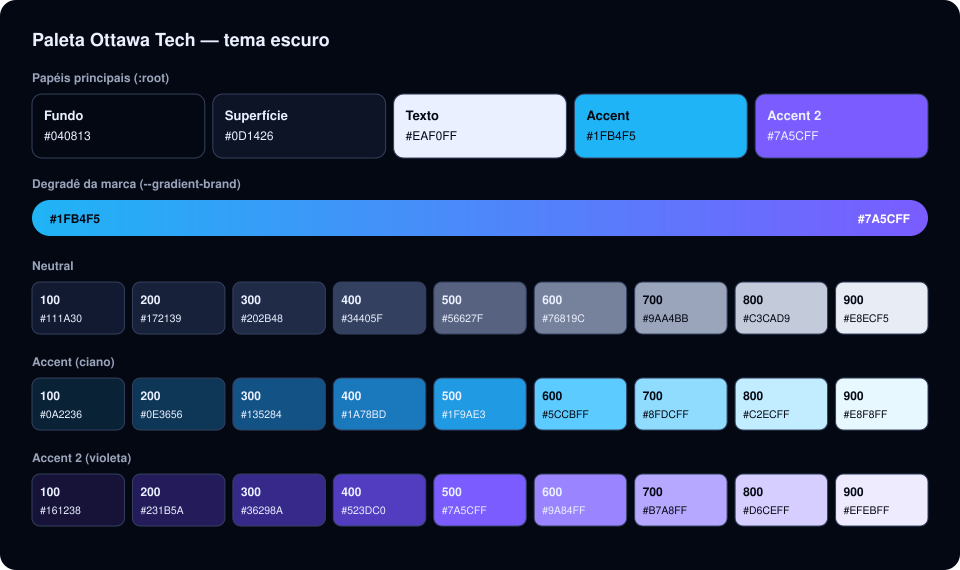

# Design system

A interface usa um conjunto pequeno de **tokens** (cores, tipografia, espaçamento, raios e sombras) e de
classes de componente, definidos em um único arquivo:
[`design-system.css`](../src/presentation/styles/design-system.css). Ele parte do design system
"Organic" do protótipo e foi retunado para a identidade da Ottawa Tech (design v2: tema escuro, ciano e
violeta). Os componentes React que usam esses tokens ficam em
[`src/presentation/components`](../src/presentation/components).

Decisões relacionadas: [ADR-0005 — CSS Modules e design tokens](adr/0005-css-modules-e-design-tokens.md) e
[ADR-0007 — Identidade visual Ottawa Tech](adr/0007-identidade-visual-ottawa-tech.md).

## Sumário

- [Princípios](#princípios)
- [Paleta de cores](#paleta-de-cores)
- [Tipografia](#tipografia)
- [Espaçamento, raios e sombras](#espaçamento-raios-e-sombras)
- [Layout e responsividade](#layout-e-responsividade)
- [Componentes](#componentes)
- [Usando os tokens](#usando-os-tokens)
- [Acessibilidade](#acessibilidade)
- [Identidade visual e ativos](#identidade-visual-e-ativos)

## Princípios

- **Tokens antes de valores.** Cores, espaços e raios vêm de variáveis CSS (`var(--color-accent)`); não
  se escrevem hexadecimais nos componentes.
- **Tema escuro único.** O sistema declara `color-scheme: dark`; não há tema claro.
- **Formato de pílula.** Botões, tags, campos e controles segmentados são arredondados por completo
  (`border-radius: 999px`); cards e diálogos usam raios grandes.
- **A cor nunca é o único sinal.** Todo status aparece escrito (por exemplo, "Pago", "Pendente"); a cor
  apenas reforça.
- **Texto sem jargão técnico.** As telas não exibem rotas nem endpoints. As mensagens de erro das regras
  de negócio ainda trazem o código da regra (por exemplo, "RN04 — …").

## Paleta de cores



### Papéis principais

| Token | Valor | Uso |
| --- | --- | --- |
| `--color-bg` | `#040813` | Fundo da aplicação |
| `--color-surface` | `#0d1426` | Cards, campos, diálogos |
| `--color-text` | `#eaf0ff` | Texto principal |
| `--color-accent` | `#1fb4f5` (ciano) | Ação principal, item ativo, links, foco |
| `--color-accent-2` | `#7a5cff` (violeta) | Destaques secundários: avatar, barras de ocupação, reservas pagas |
| `--color-divider` | `#eaf0ff` a 14% | Linhas e bordas |
| `--gradient-brand` | ciano → violeta | Botão primário |
| `--gradient-brand-hover` | `#5ccbff` → `#9a84ff` | Botão primário ao passar o mouse |

### Rampas tonais

Cada papel tem uma rampa de 9 passos (`100` a `900`): `--color-neutral-*`, `--color-accent-*` e
`--color-accent-2-*`. No tema escuro a rampa é **invertida em relação ao tema claro**: o passo `100` é o
mais próximo do fundo (escuro) e o `900` é o mais claro. Por isso uma "tag suave" combina o passo `100`
como fundo com o `800` como texto.

### Semântica de status

Implementada em [`status.ts`](../src/presentation/components/ui/status.ts); cada status vira uma tag.

| Tom da tag | Cor | Reserva | Pagamento | Quadra | Cliente |
| --- | --- | --- | --- | --- | --- |
| `accent-2` | violeta | Confirmada | Pago | Ativa | Ativo |
| `accent` | ciano | Pendente | Pendente | Manutenção | — |
| `neutral` | cinza-azulado | Cancelada, Concluída | Cancelado, Estornado | Inativa | Inativo |

Na grade de reservas do administrador, uma reserva com pagamento confirmado usa `--color-accent-2-300`
e uma com pagamento pendente usa `--color-accent-200`; quadras indisponíveis têm fundo listrado.

## Tipografia

| Uso | Fonte | Peso | Como é carregada |
| --- | --- | --- | --- |
| Títulos (`h1`–`h6`), botões, valores em destaque | **Sora** | 600 (`--font-heading-weight`) | Pacote `@fontsource-variable/sora`, empacotado pelo Vite |
| Texto corrente | **Figtree** | 400 a 700 | Arquivos `woff2` em [`styles/fonts`](../src/presentation/styles/fonts) |

As duas fontes são hospedadas com o app: o sistema não depende de CDN. Os tokens são `--font-heading` e
`--font-body`.

| Elemento | Tamanho | Observação |
| --- | --- | --- |
| Texto base (`body`) | 15 px, entrelinha 1,55 | |
| `h1` | 42 px | O título de página (`PageHeader`) usa 36 px, e 28 px a partir de 600 px de largura para baixo |
| `h2` / `h3` / `h4` / `h5` | 32 / 25 / 20 / 16 px | |
| `h6` | 13 px | Em maiúsculas, com espaçamento entre letras |
| Tabelas | 14 px | Cabeçalhos de coluna em 11 px, maiúsculas |
| Notas e legendas | 11 a 13 px | |

## Espaçamento, raios e sombras

| Token | Valores |
| --- | --- |
| `--space-1` … `--space-8` | 4,4 · 8,8 · 13,2 · 17,6 · 26,4 · 35,2 px (`--space-1`, `-2`, `-3`, `-4`, `-6`, `-8`) |
| `--radius-sm` / `-md` / `-lg` | 8 · 16 · 28 px; pílulas usam 999 px; cards e diálogos, 1,15 × `--radius-lg` |
| `--shadow-sm` / `-md` / `-lg` | `sm`: contorno de 1 px; `md` e `lg`: contorno mais sombra ambiente, cada vez mais profunda |

## Layout e responsividade

- Conteúdo centralizado com largura máxima de **1220 px** (layout autenticado).
- Grades com `repeat(auto-fit, minmax(..., 1fr))`: as colunas quebram sozinhas conforme a largura, sem
  depender de muitos breakpoints.
- Os `@media` existentes usam `max-width` de 420, 480, 600 e 767 px, para ajustes pontuais
  (cabeçalho, títulos, formulários).
- Tabelas largas e a grade de reservas rolam **dentro do card**; nas telas verificadas em 375 px a página
  não ganha rolagem horizontal.
- Telas pequenas: a navegação e o cabeçalho quebram em mais linhas, e os diálogos ocupam a largura útil.

## Componentes

Componentes de base, em [`components/ui`](../src/presentation/components/ui) (importe de
`@/presentation/components/ui`):

| Componente | Para quê | Props principais |
| --- | --- | --- |
| `Button` | Ação (`.btn`) | `variant` (`primary`, `secondary`, `ghost`, `plain`), `size` (`md`, `lg`, `xl`), `block`, `loading` |
| `Pill` / `pillClassName` | Chip selecionável: filtros, durações, navegação | `active`, `tone` (`surface`, `plain`), `size` (`sm`, `md`, `lg`) |
| `Card`, `CardKicker` | Superfície de conteúdo | `elevation` (`none`…`lg`), `padding` (`sm`, `md`, `lg`), `gap`, `scrollX` |
| `Tag`, `StatusTag` | Rótulo curto; `StatusTag` aplica a [semântica de status](#semântica-de-status) | `tone`; `kind` e `status` |
| `Field`, `Input`, `Select` | Rótulo, controle e mensagem de erro ou ajuda | `label`, `error`, `hint`; `invalid` |
| `SegmentedControl` | Escolha única entre poucas opções ("Entrar \| Criar conta") | `options`, `value`, `onChange` |
| `Dialog` | Modal acessível (Esc e clique no fundo fecham) | `open`, `title`, `actions`, `size`, `variant` |
| `DetailList` | Pares rótulo/valor (resumo da reserva) | `items` |
| `DataTable` | Tabela com rolagem horizontal e estado vazio | `columns`, `rows`, `getRowKey`, `minWidth` |
| `StatCard` | Indicador numérico | `label`, `value`, `hint`, `size` |
| `PageHeader` | Título da página com ações | `title`, `actions` |
| `LoadingState`, `EmptyState`, `ErrorState`, `AsyncContent` | Estados de carregamento, vazio e erro; `AsyncContent` escolhe o estado a partir de uma query | `query`, `children` |
| `Pagination`, `ProgressBar`, `Avatar`, `BrandMark` | Paginação, barra de ocupação, iniciais do usuário e logotipo | — |

Componentes compartilhados de domínio: [`DateSelector`](../src/presentation/components/DateSelector)
(faixa de 7 dias e calendário), [`SlotGrid`](../src/presentation/components/SlotGrid) (grade de horários),
[`MetodoPagamentoPicker`](../src/presentation/components/MetodoPagamentoPicker) e
[`ClienteFields`](../src/presentation/components/forms) (campos do cadastro de cliente com máscaras).

## Usando os tokens

Estilos de componente ficam em um CSS Module ao lado do `.tsx`:

```css
/* MeuCard.module.css */
.card {
  padding: var(--space-4);
  background: var(--color-surface);
  border: 1px solid var(--color-divider);
  border-radius: var(--radius-md);
  box-shadow: var(--shadow-sm);
}

.destaque {
  color: var(--color-accent);
}
```

```tsx
import styles from './MeuCard.module.css';

export function MeuCard() {
  return <div className={styles.card}>…</div>;
}
```

Regras:

- Use sempre `var(--token)`. Se precisar de uma cor nova, crie um token em `design-system.css`.
- Prefira os componentes de `components/ui` a recriar botões, tags e diálogos.
- Valores dinâmicos (largura de uma barra, por exemplo) podem usar `style`; o resto vai no CSS Module.
- As únicas cores fixas fora do arquivo de tokens são o fundo do logotipo (`BrandMark`) e a
  `theme-color` do `index.html`, ambas `#040813`.
- Para mudar a identidade visual, altere os tokens em `:root`: as telas seguem a mudança.

## Acessibilidade

O que o sistema já faz:

- Anel de foco visível (`:focus-visible`, 2 px em `--color-accent`) em todos os controles.
- Link "Pular para o conteúdo" no início do layout autenticado.
- Rótulos associados aos campos, erros de formulário com `role="alert"`, mensagens de sucesso e
  erro em região `aria-live`.
- `Dialog` com `role="dialog"`, `aria-modal` e retorno do foco ao fechar; `SegmentedControl` como grupo
  de rádio; filtros e durações com `aria-pressed`; `ProgressBar` com `role="progressbar"`.
- Cabeçalhos de tabela com `scope="col"`.
- Animações reduzidas quando o sistema pede `prefers-reduced-motion`.

### Contraste

Razões calculadas com a fórmula do WCAG 2.x a partir dos tokens. O mínimo para texto normal (nível AA)
é **4,5 : 1**.

| Combinação | Razão | AA |
| --- | --- | --- |
| Texto principal sobre o fundo | 17,5 : 1 | Passa |
| Texto principal sobre a superfície | 16,1 : 1 | Passa |
| Texto secundário (`neutral-700`) sobre o fundo | 8,0 : 1 | Passa |
| Texto secundário (`neutral-700`) sobre a superfície | 7,3 : 1 | Passa |
| Ciano (`accent`) sobre o fundo | 8,5 : 1 | Passa |
| Ciano (`accent`) sobre a superfície | 7,8 : 1 | Passa |
| Item ativo: fundo escuro sobre ciano | 8,5 : 1 | Passa |
| Tag `accent` (`accent-800` sobre `accent-100`) | 12,9 : 1 | Passa |
| Tag `accent-2` (`accent-2-800` sobre `accent-2-100`) | 12,0 : 1 | Passa |
| Tag `neutral` (`neutral-800` sobre `neutral-100`) | 10,5 : 1 | Passa |
| **Botão primário: branco sobre o início do degradê (ciano)** | **2,4 : 1** | **Não passa** |
| **Botão primário: branco sobre o fim do degradê (violeta)** | **4,4 : 1** | **Não passa** (por pouco) |

**Ponto de atenção:** o texto branco do botão primário (14 px, peso 600) tem pouco contraste sobre o
ciano. A definição vem do design v2 (`color: #fff` sobre o degradê). Duas saídas possíveis: usar texto
escuro `#040813` (8,5 : 1 sobre o ciano) ou escurecer o início do degradê. Vale decidir com o time de
design antes de mudar.

## Identidade visual e ativos

| Ativo | Arquivo |
| --- | --- |
| Símbolo "OT" no cabeçalho e no login | [`ottawa-tech-simbolo.jpg`](../src/presentation/assets/ottawa-tech-simbolo.jpg) |
| Favicon e ícone de tela inicial do iOS | `public/favicon.png` e `public/apple-touch-icon.png` |
| Cor da barra do navegador | `theme-color` `#040813` no `index.html` |

O símbolo é um recorte do logotipo da Ottawa Tech fornecido no design v2. No tamanho grande, o
`BrandMark` acrescenta a assinatura "by Ottawa Tech".

A paleta anterior (protótipo "Organic": fundo `#f5ead8`, destaque laranja `#c67139`, verde `#7a8a5e`,
títulos em Caprasimo) foi substituída em 28/09/2026; o histórico está no
[ADR-0007](adr/0007-identidade-visual-ottawa-tech.md) e no [CHANGELOG](../CHANGELOG.md).
