# Telas e fluxos

Visão de uso do sistema: quais telas existem, o que cada uma faz e como os fluxos principais se
encadeiam. As capturas usam os dados de demonstração do [backend simulado](getting-started.md#backend-simulado-e-dados-de-demonstração).
As regras citadas (RFxx e RNxx) estão em [business-rules.md](business-rules.md).

## Sumário

- [Mapa de navegação](#mapa-de-navegação)
- [Telas públicas](#telas-públicas)
- [Telas do cliente](#telas-do-cliente)
- [Telas do administrador](#telas-do-administrador)
- [Páginas de erro](#páginas-de-erro)
- [Fluxos principais](#fluxos-principais)
- [Estados e responsividade](#estados-e-responsividade)

## Mapa de navegação

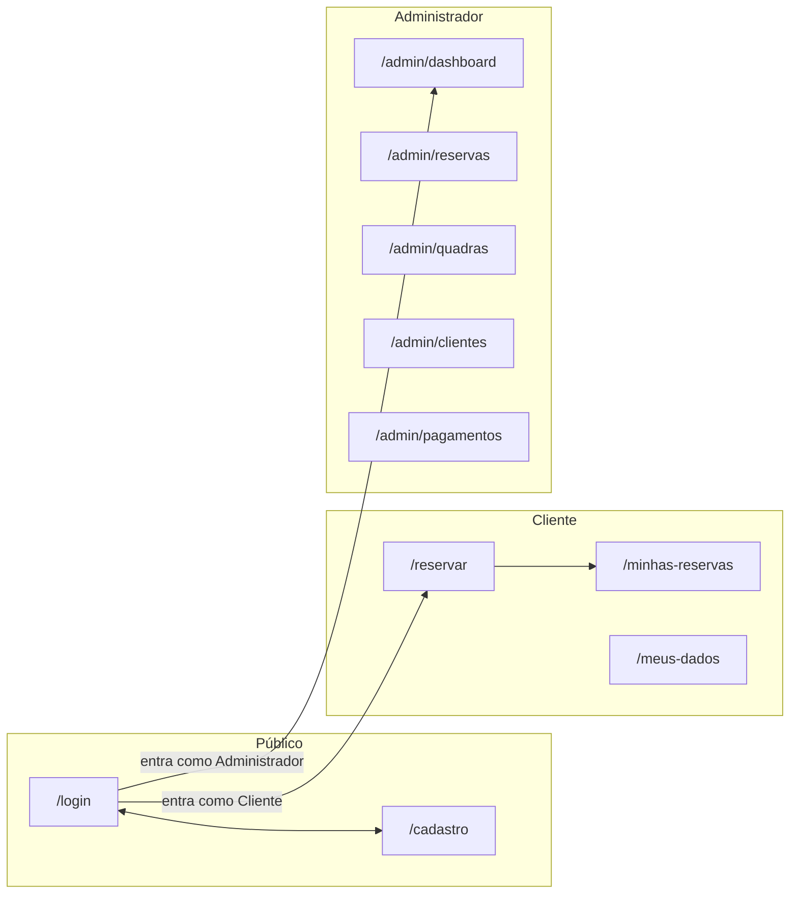
```mermaid
flowchart LR
    subgraph publico["Público"]
        login["/login"] <--> cadastro["/cadastro"]
    end

    subgraph cliente["Cliente"]
        reservar["/reservar"] --> minhas["/minhas-reservas"]
        dados["/meus-dados"]
    end

    subgraph admin["Administrador"]
        dashboard["/admin/dashboard"]
        grade["/admin/reservas"]
        quadras["/admin/quadras"]
        clientes["/admin/clientes"]
        pagamentos["/admin/pagamentos"]
    end

    login -->|entra como Cliente| reservar
    login -->|entra como Administrador| dashboard
```

| Rota | Perfil | Tela | Requisitos |
| --- | --- | --- | --- |
| `/login` | Público | [Entrar](#entrar) | Autenticação (Sprint 5) |
| `/cadastro` | Público | [Criar conta](#criar-conta) | RF01 |
| `/reservar` | Cliente | [Reservar quadra](#reservar-quadra) | RF08–RF10 |
| `/minhas-reservas` | Cliente | [Minhas reservas](#minhas-reservas) | RF11, RF12, RF14, RF15 |
| `/meus-dados` | Cliente | [Meus dados](#meus-dados) | RF02 |
| `/admin/dashboard` | Administrador | [Visão geral da arena](#visão-geral-da-arena) | Sprint 6 |
| `/admin/reservas` | Administrador | [Grade de reservas](#grade-de-reservas) | RF11–RF13 |
| `/admin/quadras` | Administrador | [Quadras](#quadras) | RF05–RF08 |
| `/admin/clientes` | Administrador | [Clientes](#clientes) | RF01–RF04 |
| `/admin/pagamentos` | Administrador | [Pagamentos](#pagamentos) | RF14–RF16 |

Todas as telas autenticadas compartilham o mesmo cabeçalho: logotipo, seletor **Cliente | Admin**
(somente no modo simulado, para alternar entre as contas de demonstração), usuário logado, botão **Sair**
e a navegação do perfil.

## Telas públicas

### Entrar

`/login` — porta de entrada do sistema. À esquerda, a apresentação da arena; à direita, o cartão de
acesso com as abas **Entrar** e **Criar conta**.

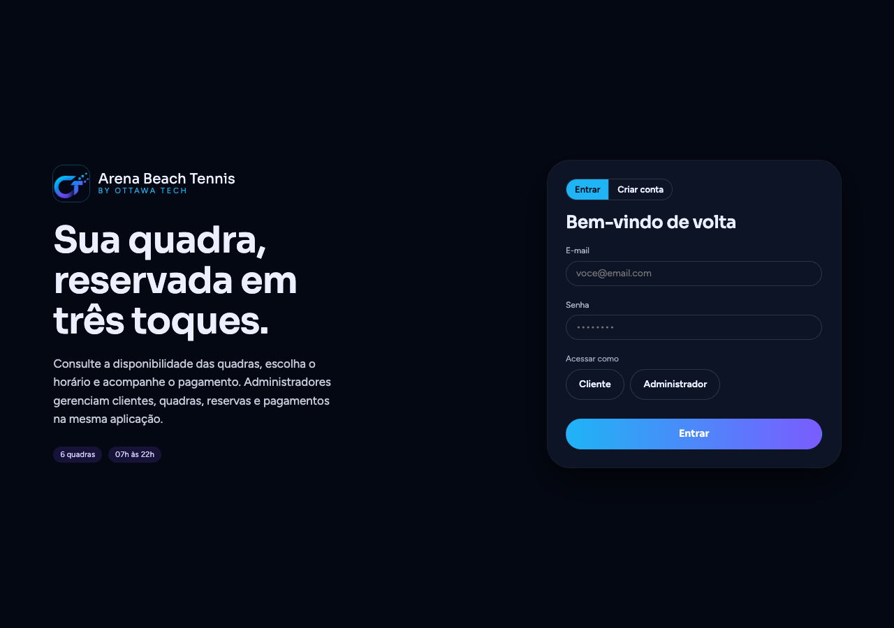

- Campos: e-mail e senha, com validação de formato antes do envio.
- No modo simulado, os botões **Acessar como** (Cliente, Administrador) preenchem as credenciais de
  demonstração.
- Erros: "E-mail ou senha inválidos." para credenciais erradas e "Cadastro inativo. Procure a
  administração da arena." para clientes inativos.
- Depois de entrar, o usuário vai para a página que tentou abrir (se o perfil puder acessá-la) ou para a
  home do perfil: `/reservar` para o cliente e `/admin/dashboard` para o administrador.

### Criar conta

`/cadastro` — autocadastro do cliente (RF01).

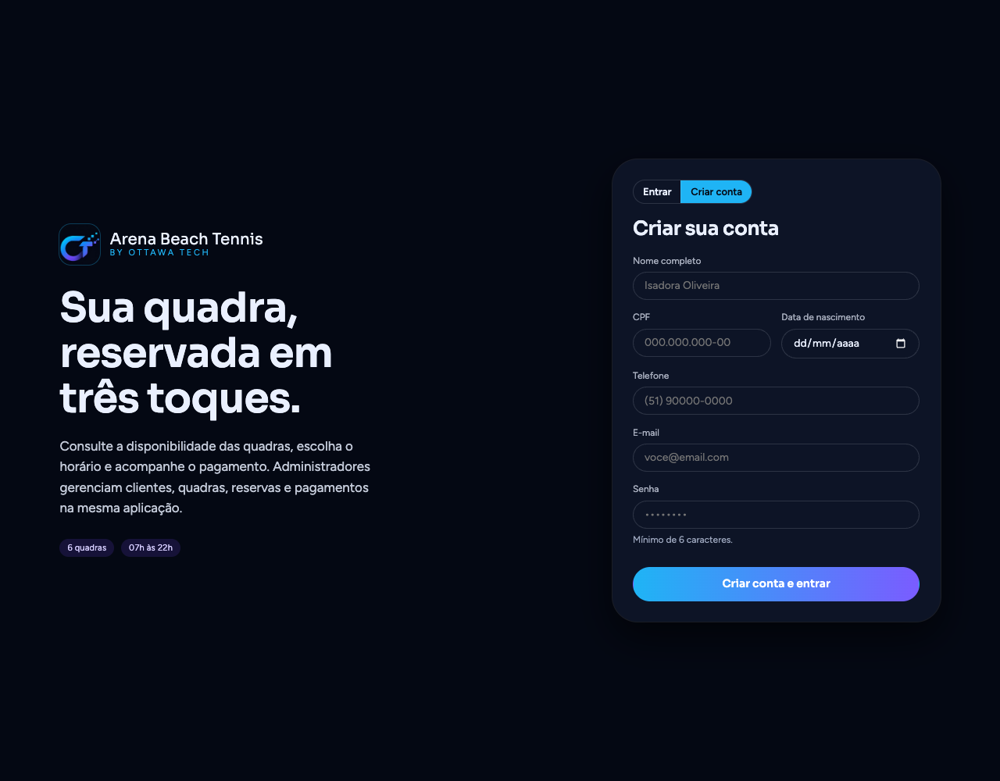

- Campos: nome completo, CPF, data de nascimento, telefone, e-mail e senha (mínimo de 6 caracteres),
  com máscaras de CPF e telefone e validação do CPF pelos dígitos verificadores.
- CPF ou e-mail já cadastrados (RN01 e RN02) aparecem como erro abaixo do campo correspondente.
- Ao concluir, o cliente é criado como **Ativo**, já entra no sistema e cai em `/reservar`.

## Telas do cliente

### Reservar quadra

`/reservar` — a tela central do sistema. O cliente monta a reserva em quatro passos e acompanha o
resumo ao lado.

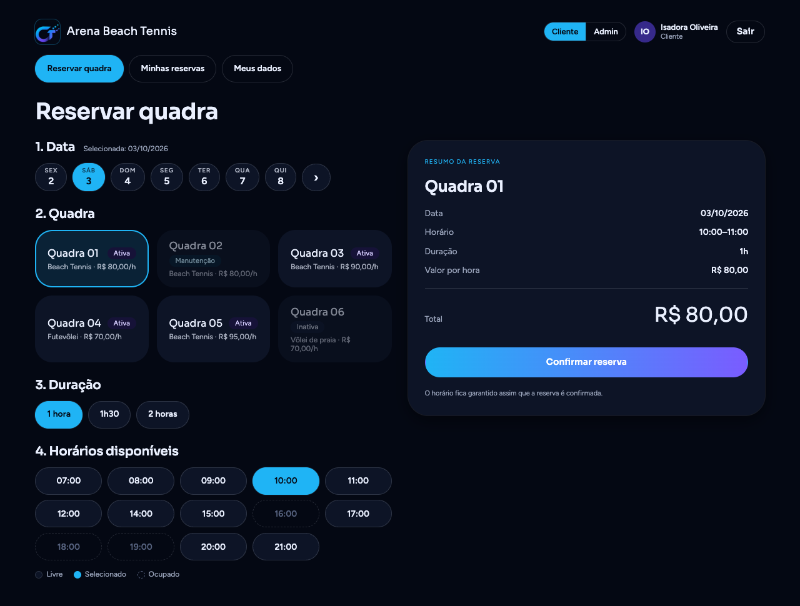

1. **Data:** faixa com 7 dias e um calendário (botão `›`) para qualquer dia da janela de reservas: de hoje
   até 29 dias à frente (30 dias no total).
2. **Quadra:** cartões com nome, status, tipo e valor por hora. Quadras em manutenção ou inativas ficam
   esmaecidas e, ao toque, explicam por que não podem ser reservadas (RN03).
3. **Duração:** 1 hora, 1h30 ou 2 horas.
4. **Horários disponíveis:** grade de horários de início. Cada horário é livre, selecionado ou ocupado;
   tocar em um ocupado mostra o motivo (já passou, outra reserva, fora do horário de funcionamento).

O **resumo da reserva** mostra quadra, data, horário, duração, valor por hora e o **total**
(valor por hora × duração, RN07). O botão **Confirmar reserva** só habilita com um horário escolhido e
abre o diálogo de pagamento.

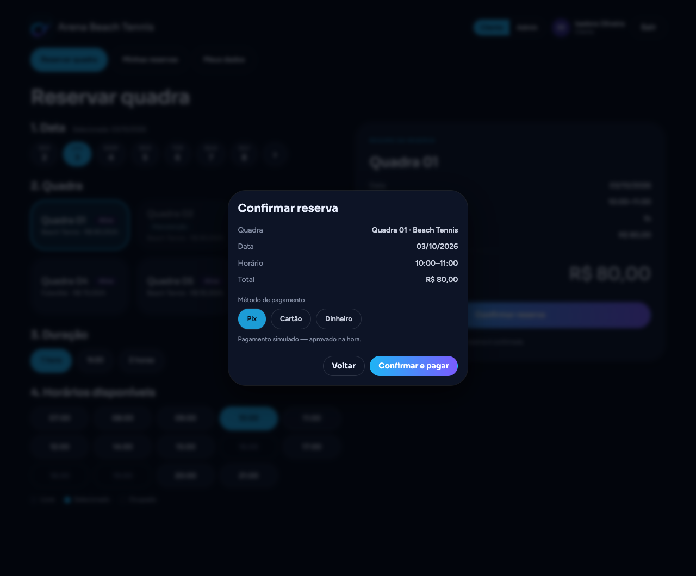

No diálogo, o cliente escolhe **Pix**, **Cartão** ou **Dinheiro**. Pix e cartão são aprovados na hora
(pagamento simulado); dinheiro fica pendente até o administrador confirmar o recebimento. Ao confirmar, o
sistema cria a reserva, registra o pagamento e leva o cliente para **Minhas reservas** com um aviso de
sucesso. Se alguém reservou o mesmo horário antes (RN04), o aviso de erro aparece e os horários são
recarregados.

### Minhas reservas

`/minhas-reservas` — acompanhamento das reservas e dos pagamentos do cliente (RF11, RF15).

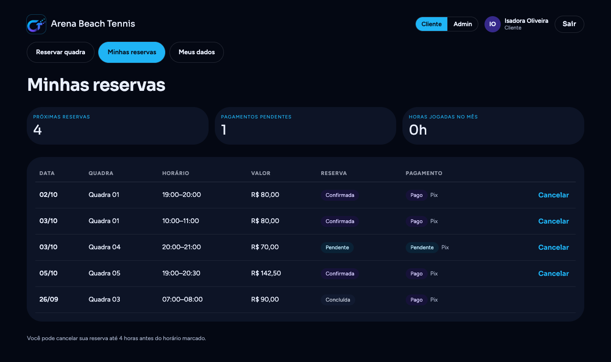

- **Indicadores:** próximas reservas, pagamentos pendentes e horas jogadas no mês.
- **Tabela:** data, quadra, horário, valor, status da reserva e do pagamento. As próximas reservas vêm
  primeiro, em ordem cronológica; as passadas depois, da mais recente para a mais antiga.
- **Cancelar** aparece enquanto faltarem 4 horas ou mais para o início (RN08). O diálogo informa se o
  pagamento será estornado ou cancelado.
- **Pagar** aparece em reservas sem pagamento registrado.

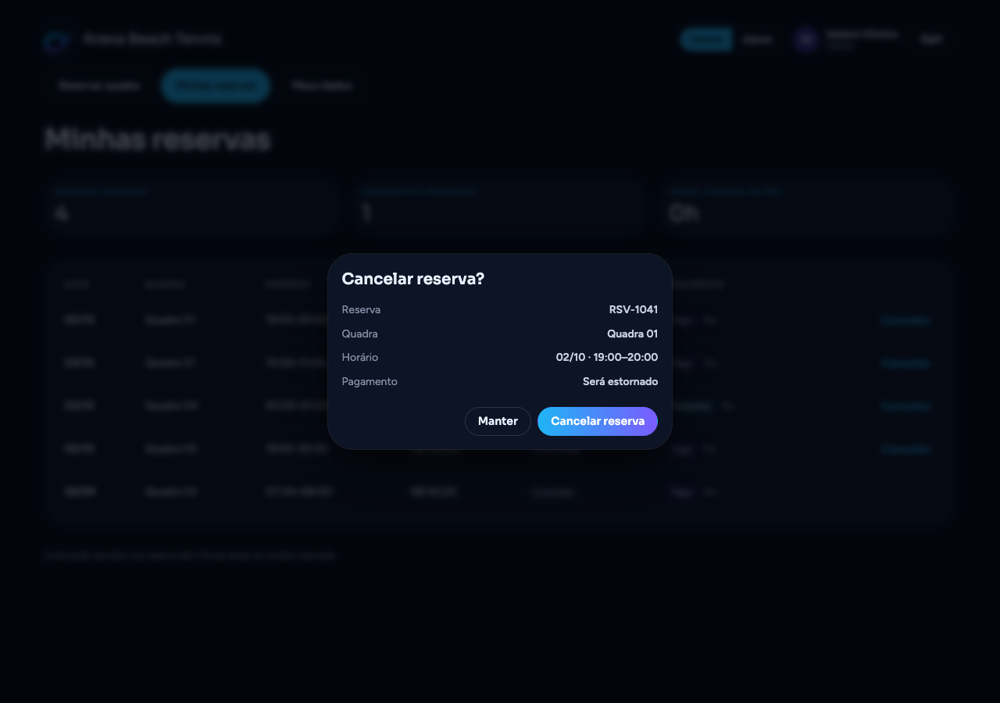

### Meus dados

`/meus-dados` — o cliente atualiza o próprio cadastro (RF02).

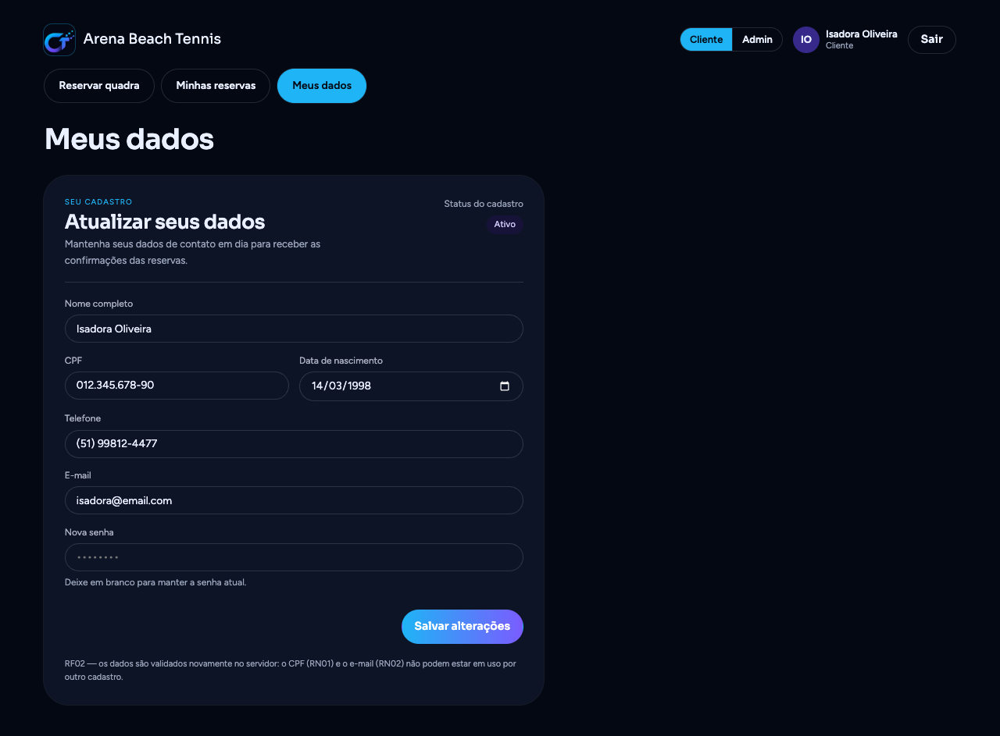

Os campos são os mesmos do cadastro; a senha é opcional (em branco, mantém a atual). O status do cadastro
aparece no canto do cartão e só o administrador o altera.

## Telas do administrador

### Visão geral da arena

`/admin/dashboard` — home do administrador.

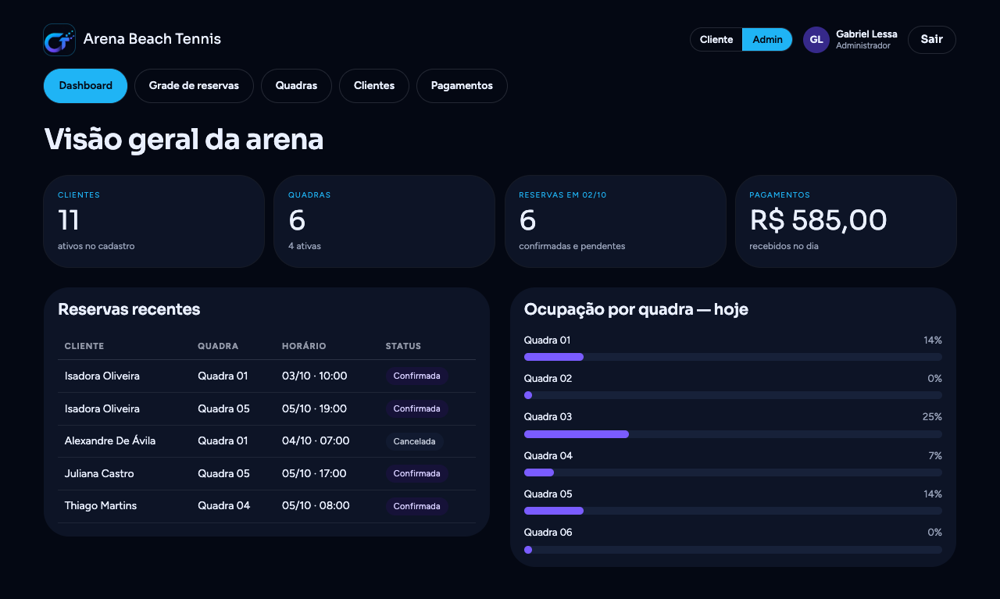

- **Indicadores:** clientes ativos, total de quadras (com quantas estão ativas), reservas do dia e valor
  recebido no dia.
- **Reservas recentes:** as cinco últimas reservas criadas, com cliente, quadra, horário e status.
- **Ocupação por quadra — hoje:** barra com o percentual de horas reservadas de cada quadra.

### Grade de reservas

`/admin/reservas` — a agenda do dia em uma matriz de horários por quadra (RF11).

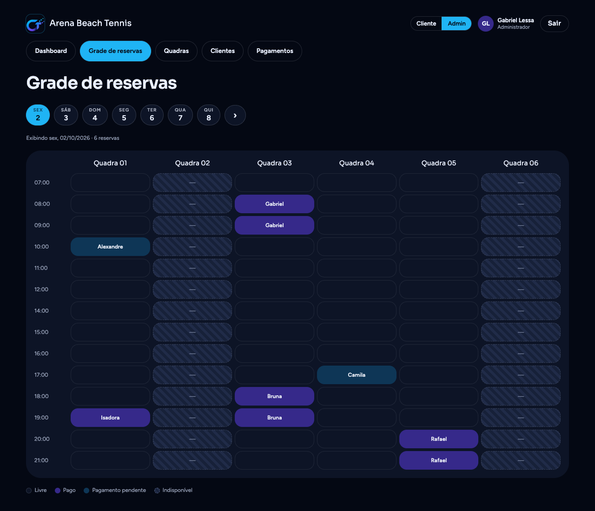

- O seletor de data permite navegar de 30 dias atrás até o fim da janela de reservas (hoje + 29 dias).
- Cada célula é **livre**, **reservada** (com o primeiro nome do cliente; violeta se o pagamento foi
  confirmado, azul-escuro se está pendente) ou **indisponível** (quadra em manutenção ou inativa, com
  fundo listrado).
- Clicar em uma reserva abre o **detalhe**: cliente, quadra, horário, valor, pagamento e status.

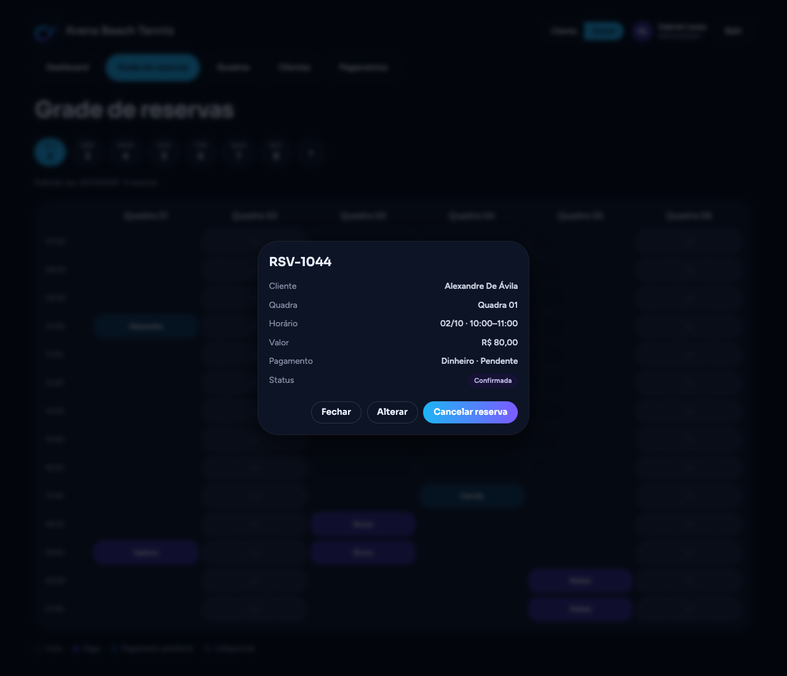

No detalhe, o administrador pode **Alterar** a reserva (RF13: quadra, data, duração e horário, com o
horário atual contando como livre) e **Cancelar reserva**, com confirmação antes. Reservas já encerradas
só podem ser consultadas.

### Quadras

`/admin/quadras` — cadastro e situação das quadras (RF05–RF07).

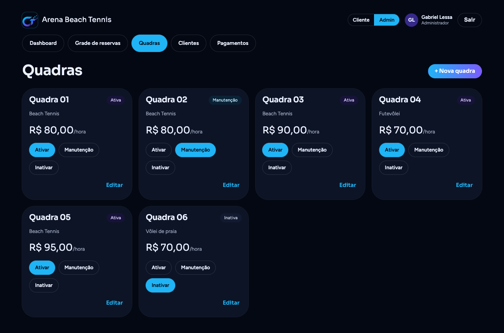

Cada cartão mostra nome, tipo, valor por hora e o status atual. Os botões **Ativar**, **Manutenção** e
**Inativar** mudam a situação na hora; **Editar** abre o formulário. **+ Nova quadra** cadastra uma quadra
com nome, tipo, valor por hora e status.

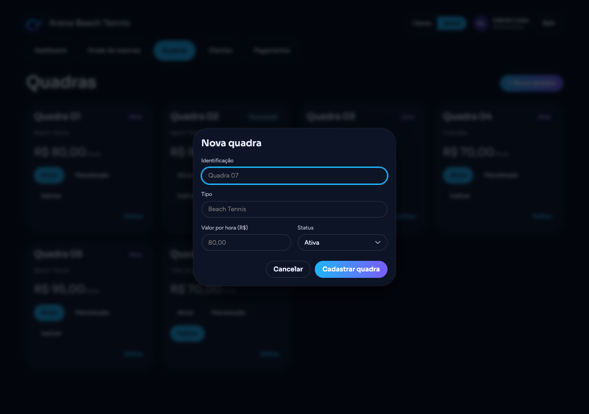

### Clientes

`/admin/clientes` — gestão dos clientes (RF01–RF04).

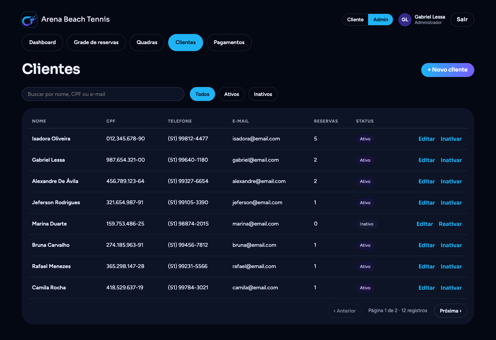

- **Busca** por nome, CPF ou e-mail e filtro **Todos | Ativos | Inativos**; a lista é paginada.
- **Editar** abre o formulário de cadastro, e **+ Novo cliente** cria um cliente (CPF e e-mail únicos,
  RN01 e RN02).
- **Inativar** e **Reativar** mudam o status sem apagar o histórico (RF04). Um cliente inativo não consegue
  entrar nem reservar.

### Pagamentos

`/admin/pagamentos` — acompanhamento e confirmação dos pagamentos (RF14–RF16).

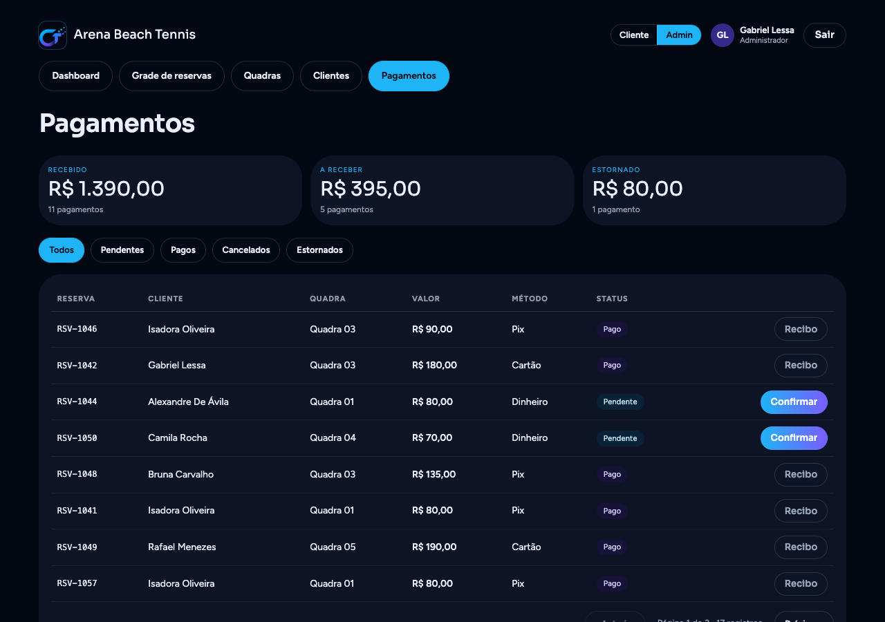

- **Resumo:** valores recebido, a receber e estornado, com a quantidade de pagamentos de cada grupo.
- **Filtros** por status (todos, pendentes, pagos, cancelados, estornados) e paginação.
- **Confirmar** aparece nos pagamentos pendentes e marca o recebimento (RF16); nos demais, **Recibo** abre
  os dados do pagamento.

## Páginas de erro

- **Página não encontrada (404):** "Bola fora!", com botão para voltar ao início.
- **Erro inesperado em uma tela:** a mensagem aparece dentro do layout, com os botões "Voltar para o
  início" e "Recarregar página".
- **Sem permissão:** abrir a rota de outro perfil leva o usuário para a home do próprio perfil.

## Fluxos principais

### Reservar uma quadra (cliente)

Baseado no fluxo da seção 5 da Especificação 1.0.

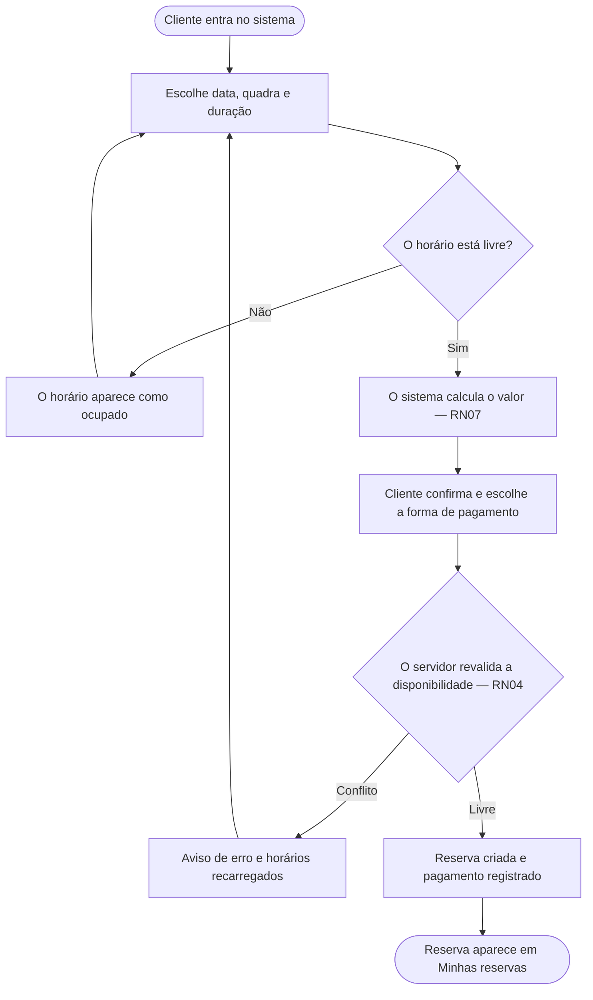
```mermaid
flowchart TD
    A([Cliente entra no sistema]) --> B[Escolhe data, quadra e duração]
    B --> C{O horário está livre?}
    C -- Não --> D[O horário aparece como ocupado]
    D --> B
    C -- Sim --> E[O sistema calcula o valor — RN07]
    E --> F[Cliente confirma e escolhe a forma de pagamento]
    F --> G{O servidor revalida a disponibilidade — RN04}
    G -- Conflito --> H[Aviso de erro e horários recarregados]
    H --> B
    G -- Livre --> I[Reserva criada e pagamento registrado]
    I --> J([Reserva aparece em Minhas reservas])
```

### Cancelar uma reserva (cliente)

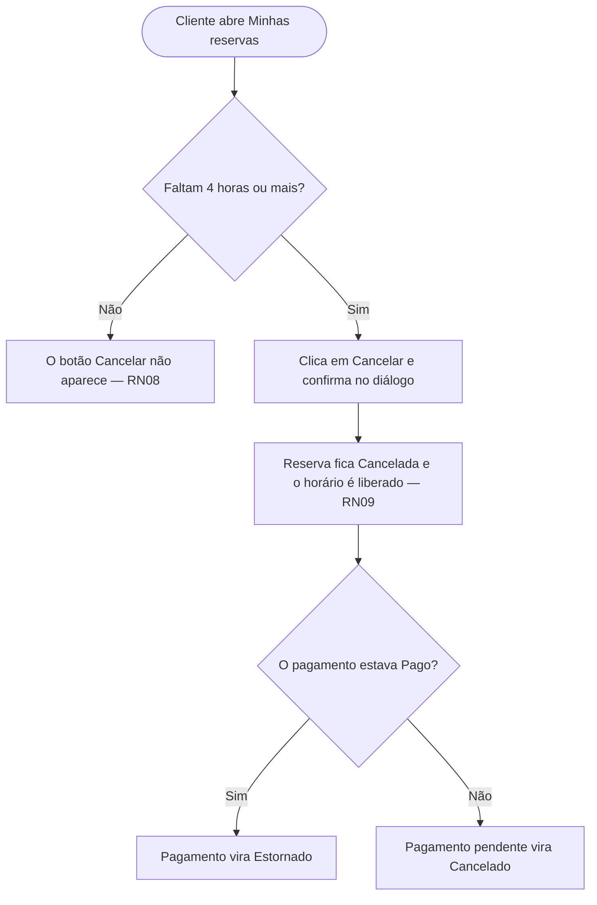
```mermaid
flowchart TD
    A([Cliente abre Minhas reservas]) --> B{Faltam 4 horas ou mais?}
    B -- Não --> C[O botão Cancelar não aparece — RN08]
    B -- Sim --> D[Clica em Cancelar e confirma no diálogo]
    D --> E[Reserva fica Cancelada e o horário é liberado — RN09]
    E --> F{O pagamento estava Pago?}
    F -- Sim --> G[Pagamento vira Estornado]
    F -- Não --> H[Pagamento pendente vira Cancelado]
```

### Pagamento em dinheiro (cliente e administrador)

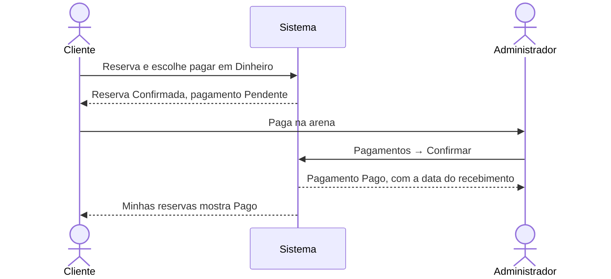
```mermaid
sequenceDiagram
    actor C as Cliente
    participant S as Sistema
    actor A as Administrador

    C->>S: Reserva e escolhe pagar em Dinheiro
    S-->>C: Reserva Confirmada, pagamento Pendente
    C->>A: Paga na arena
    A->>S: Pagamentos → Confirmar
    S-->>A: Pagamento Pago, com a data do recebimento
    S-->>C: Minhas reservas mostra Pago
```

### Alterar uma reserva (administrador)

Grade de reservas → clicar na reserva → **Alterar** → escolher nova quadra, data, duração e horário (o
horário atual aparece como livre) → **Salvar alteração**. O valor é recalculado; se o pagamento já estiver
pago e o valor mudar, o sistema recusa a alteração.

## Estados e responsividade

- **Carregando, vazio e erro:** toda lista mostra um indicador de carregamento, uma mensagem quando não há
  registros e, se a chamada falhar, o motivo com o botão **Tentar novamente**.
- **Avisos:** confirmações e erros aparecem em uma mensagem flutuante na parte de baixo da tela.
- **Telas pequenas:** o layout se reorganiza em uma coluna; tabelas e a grade rolam dentro do cartão.

| Login | Reservar quadra |
| :-: | :-: |
|  | 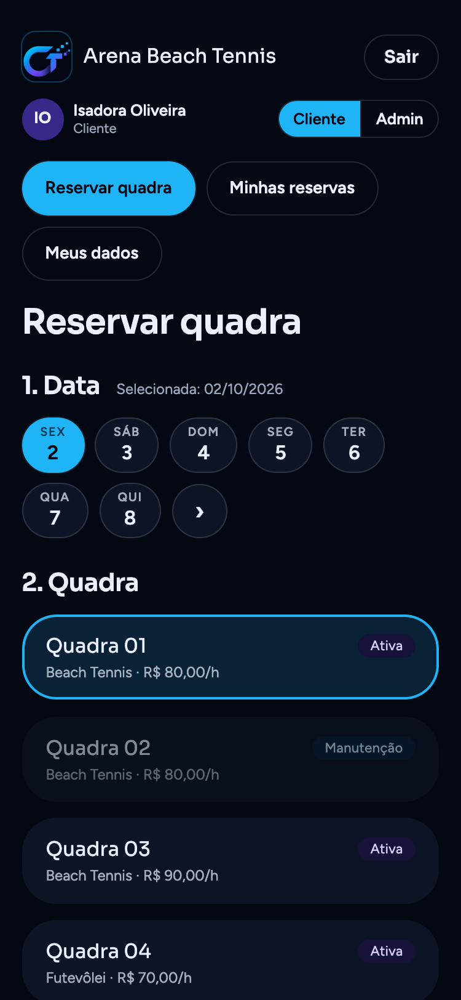 |

As capturas foram feitas com os dados de demonstração, em 1280 × 900 px (computador) e 375 × 812 px
(celular). Ao alterar uma tela, atualize a captura correspondente em `docs/images/`.
